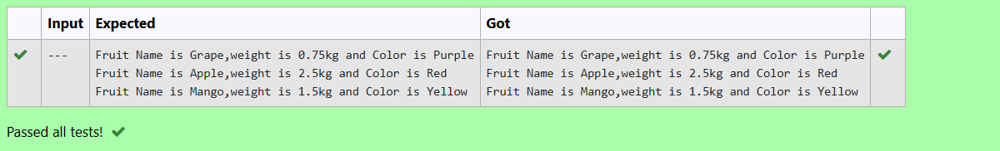

# Ex.No:1(A) CLASS & OBJECTS

## AIM:
To create a class named 'Fruit' with String variables name, color and a double variable weight.


## ALGORITHM :

1. Start the program.
2. Define a class named `Fruit`.
3. Declare String variables `name`, `color` and a double variable `weight`.
4. Define the `main` method inside the `Fruit` class.
5. Create object `obj1` of `Fruit` and assign: `"Grape"`, `"Purple"`, `0.75`.
6. Print `obj1`'s name, weight, and color.
7. Create object `obj2` of `Fruit` and assign: `"Apple"`, `"Red"`, `2.5`.
8. Print `obj2`'s name, weight, and color.
9. Create object `obj3` of `Fruit` and assign: `"Mango"`, `"Yellow"`, `1.5`.
10. Print `obj3`'s name, weight, and color.


## PROGRAM:
 ```
/*
Question: Create a main () for class named as ‘Fruit’ it has name , color, weight as its member.  Access Grape and Mango by creating its object.[Members values are : Grape,Purple,0.75 Apple,Red,2.50 and Mango, Yellow, 1.50]

public class Fruit {
    String name;
    String color;
    double weight;
    {{ Your Code here }}    
}

Program to implement a class & objects using Java
Developed by: Muhammad Afshan A
RegisterNumber: 212223100035
*/
```

## PROGRAM QUESTIONS AND SAMPLE INPUT:


## SOURCECODE.JAVA:
```
public static void main(String args[])
{
    Fruit obj1 = new Fruit();
    obj1.name="Grape";
    obj1.color="Purple";
    obj1.weight=0.75;
    System.out.println("Fruit Name is "+obj1.name+",weight is "+obj1.weight+"kg and Color is "+obj1.color);

    Fruit obj2 = new Fruit();
    obj2.name=" Apple";
    obj2.color="Red";
    obj2.weight=2.5;
    System.out.println("Fruit Name is"+obj2.name+",weight is "+obj2.weight+"kg and Color is "+obj2.color);
    
    Fruit obj3 = new Fruit();
    obj3.name="Mango";
    obj3.color="Yellow";
    obj3.weight=1.5;
    System.out.println("Fruit Name is "+obj3.name+",weight is "+obj3.weight+"kg and Color is "+obj3.color);
    
}

```


## OUTPUT:



## RESULT:

Thus, the class named 'Fruit' with String variables 'name', 'color' and double variable 'weight' was created successfully and accessed using objects.