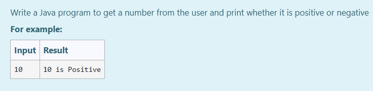
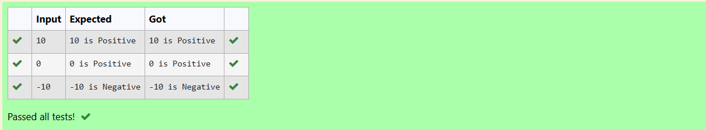

# Ex.No:1(C) CONTROL STATEMENTS

## AIM:
TO write a Java program to get a number from the user and print whether it is positive or negative.


## ALGORITHM :
1. Start the program.
2. Import the `java.util.*` or `java.util.Scanner` package to use the Scanner class.
3. Define a class named `prog`.
4. Define the `main` method.
5. Create a Scanner object `sc` to read input.
6. Read an integer value from the user and store it in variable `n`.
7. Use an `if` condition to check if `n` is greater than or equal to 0.
8. If the condition is true, print "`n is Positive`".
9. Else, print "`n is Negative`".
10. End.


## PROGRAM:
 ```
/*
Program to implement control statements using Java
Developed by: Muhammad Afshan A
RegisterNumber: 212223100035
*/
```
## PROGRAM QUESTIONS AND SAMPLE INPUT:


## SOURCECODE.JAVA:

```
import java.util.*;
class prog
{
    public static void main(String []args){
        Scanner sc= new Scanner(System.in);
        int n=sc.nextInt();
        if (n>=0)
            System.out.println(n+" is Positive");
        else
            System.out.println(n+" is Negative");
    }
}
```

## OUTPUT:



## RESULT:
Thus, the Java program to check whether given number   is positive or negative has created successfully.

