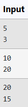

# Ex.No:1(E)  STATIC VARIABLE AND FUNCTION

## AIM:
To Multiplication of two number using 'static' method

## ALGORITHM :

1. Start the program.
2. Import the `java.util.Scanner` class.
3. Define a class named `Multiplication`.
4. Define a static method `multiply()` that takes two integers and returns their product.
5. Define the `main()` method.
6. Create a Scanner object to read user input.
7. Read two integer inputs from the user: `num1` and `num2`.
8. Call the `multiply()` method with `num1` and `num2` as arguments.
9. Store the returned value in `result` and print it.
10. End the program.


## PROGRAM:
 ```
/*
Program to implement a Static Variable and Function using Java
Developed by: Muhammad Afshan A
RegisterNumber: 212223100035
*/
```
## PROGRAM SAMPLE INPUT:


## SOURCECODE.JAVA:
```
import java.util.Scanner;
public class Multiplication 
{
    static int multiply(int num1,int num2)
    {
        return num1*num2;
    }
    
    public static void main(String[] args)
    {
        Scanner scanner = new Scanner(System.in);
        int num1 = scanner.nextInt(); 
        int num2 = scanner.nextInt();
        int result = multiply(num1, num2);
        System.out.println("multiplication is: " + result);
        scanner.close();
    }
}
```

## OUTPUT:


## RESULT:
Thus, the Java program to perform multiplication of two numbers using a static method was implemented successfully and verified sucessfully.
