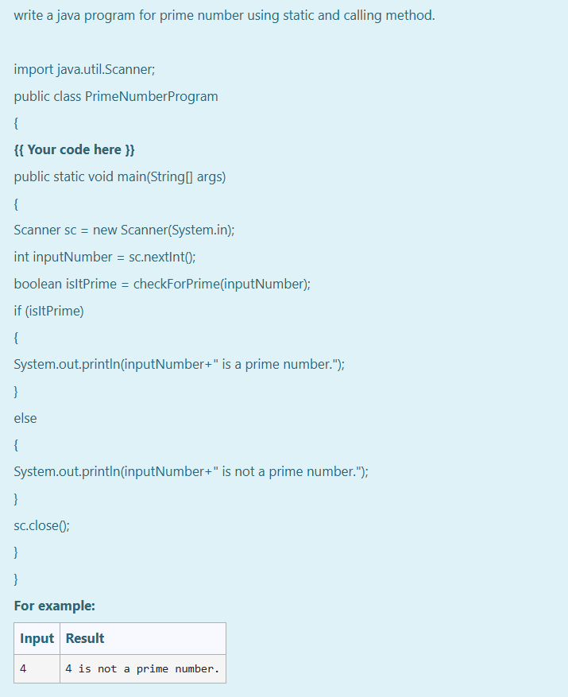
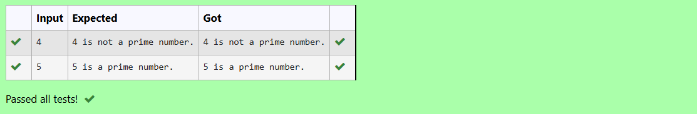

# Ex.No:2(A)  STATIC METHOD

## AIM:
To write a java program for prime number using static and calling method.


## ALGORITHM :

1. Start the program.
2. Import the `java.util.Scanner` class.
3. Define a class named `PrimeNumberProgram`.
4. Create a method `checkForPrime(int num)` that returns `true` if `num` is prime, otherwise `false`.
5. In the `checkForPrime()` method, if the number is less than or equal to 1, return `false`.
6. Loop from `2` to `√num`, and check if the number is divisible by any value. If yes, return `false`.
7. If no divisors are found, return `true`.
8. In the `main()` method, create a Scanner object to take user input.
9. Read an integer and pass it to `checkForPrime()`. Based on the result, print whether the number is prime or not.
10. End the program.


## PROGRAM:
 ```
/*
Program to implement a Static method using Java
Developed by: Muhammad Afshan A
RegisterNumber: 212223100035
*/
```
## PROGRAM QUESTION AND SAMPLE INPUT:

## SOURCECODE.JAVA:

##### STUDENT ANSWER:
```
static boolean checkForPrime(int num)
{
    if (num <= 1)
    {
        return false;
    }
    
    for(int i=2;i<=Math.sqrt(num);i++)
    {
        if(num%i==0)
        {
            return false;
        }
    }
    return true;
}
```

##### FULL SOURCECODE:
```
import java.util.Scanner;
public class PrimeNumberProgram 
{
    static boolean checkForPrime(int num)
    {
        if(num <=1)
        {
            return false;
        }
        for(int i=2;i<=Math.sqrt(num);i++)
        {
            if(num%i==0)
            {
                return false;
            }
        }
        return true;
    }
    
    public static void main(String[] args) 
    {
        Scanner sc = new Scanner(System.in);
        int inputNumber = sc.nextInt();
        boolean isItPrime = checkForPrime(inputNumber);if (isItPrime)
        {
            System.out.println(inputNumber+" is a prime number.");
        }
        else
        {
            System.out.println(inputNumber+" is not a prime number.");
        }

        sc.close();
    }

}
```

## OUTPUT:



## RESULT:
Thus the java program for prime number using static and calling method has been executed successfully.

