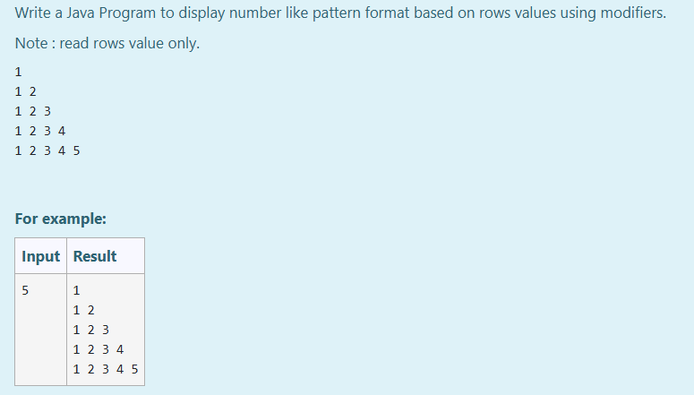

# Ex.No:2(B) ACCESS MODIFIERS

## AIM:
To Write a Java Program to display number like pattern format based on rows values using modifiers.

Note : read rows value only.

## ALGORITHM :
1. Start the program.
2. Import the `java.util.*` package to use the Scanner class.
3. Define a class `p` with a method named `pattern()` that takes an integer `rows` as input.
4. In the `pattern()` method, use a `for` loop to iterate from `1` to `rows`.
5. Inside the outer loop, use another `for` loop to print numbers from `1` to `i`.
6. After each inner loop, move to the next line using `System.out.println()`.
7. Define another class `Pattern1` with the `main()` method.
8. Create a `Scanner` object to read user input.
9. Read the number of rows and create an object of class `p`.
10. Call the `pattern()` method with the input number and print the pattern.


## PROGRAM:
 ```
/*
Program to implement a access modifiers using Java
Developed by: Muhammad Afshan A
RegisterNumber: 212223100035
*/
```
## PROGRAM QUESTION AND SAMPLE INPUT:



## SOURCECODE.JAVA:

```
import java.util.*;
class p
{
    public void pattern(int rows)
    {
        for (int i = 1; i <= rows; i++)
        {
            for (int j = 1; j <= i; j++)
            {
                System.out.print(j+ " ");
            }
            System.out.println();
        }
    }
}
public class Pattern1
{
    public static void main(String[] args)
    {
	    Scanner sc=new Scanner(System.in);
	    int rows =sc.nextInt();
	    p obj=new p();
	    obj.pattern(rows);
        
    }
}
```

## OUTPUT:


## RESULT:

Thus, a Java program to display numbers in a pattern format based on row values using modifiers was implemented and executed successfully.

