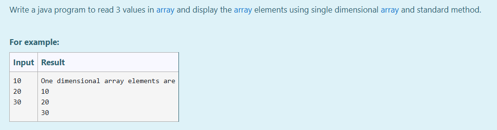
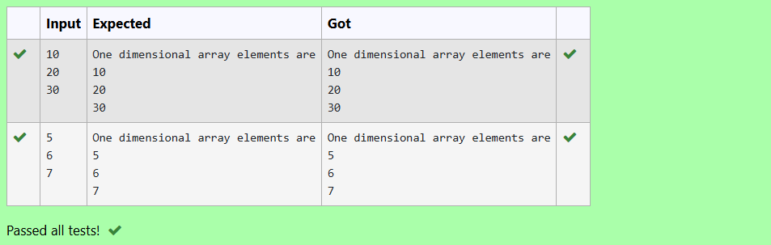

# Ex.No:2(C)    SINGLE ARRAY

## AIM:
To write a java program to read 3 values in array and display the array elements using single dimensional array and standard method.


## ALGORITHM :
1.	Start the program.
2.	Import the `Scanner` class from the `java.util` package or import  `java.util.*`
3.	Define a class named `OneD`
4.	Inside the `main` method:
-	a) Create a `Scanner` object called `sc` to take user input
-	b) Declare an integer array `arr` of size 3
-	c) Use a `for` loop to iterate from `i = 0` to `i < 3`:
-   d) Take input from the user and store it in `arr[i]`
5.	Print "One dimensional array elements are"
6.	Use another `for` loop to iterate from `i = 0` to `i < 3`:
-	a) Print each element in `arr` followed by nextline.
7.	End


## PROGRAM:
 ```
/*
Program to implement a Single Array using Java
Developed by: Muhammad Afshan A
RegisterNumber: 212223100035 
*/
```

## PROGRAM QUESTION AND SAMPLE INPUT:



## SOURCECODE.JAVA:

```
import java.util.*;
public class OneD
{
    public static void main(String args[])
    {
        int arr[]=new int[3];
        Scanner sc=new Scanner(System.in);
        System.out.println("One dimensional array elements are");
        for (int i=0;i<3;i++){
            arr[i]=sc.nextInt();
            System.out.println(arr[i]);
        }
    }
}
```

## OUTPUT:



## RESULT:
Thus, the Java program to read 3 values in array and display the array elements using single dimensional array and standard method was executed successfully.


