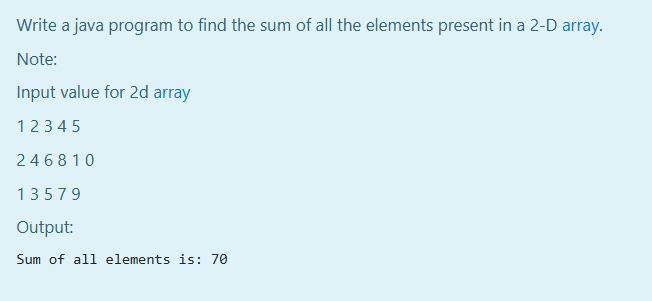

# Ex.No:2(D) MULTI-DIMENSIONAL ARRAY

## AIM:
To write a java program to find the sum of all the elements present in a 2-D array.

## ALGORITHM :
1.	Start the program.
2.	Import `Scanner` using `java.util.Scanner` or `java.util.*` and define class `Main`
3.	In `main` function:
-	a) Initialize a 2D array with the given input values in the question.
-	b) Pass the 2D array to the sum function as 2D array arguement.

4.	In `sum` function with return type `void` and `int[][] arr` as parameter:

- a) Initialize `sum` to `0`
- b) Calculate the sum of `arr` using nested loops `i` and `j` with necessary conditions

7.	Print "Sum of all elements is: `sum`" using `System.out.println` function
8.	End


## PROGRAM:
 ```
/*
Program to implement a Multi Dimensional Array using Java
Developed by: Muhammad Afshan A
RegisterNumber: 212223100035
*/
```

## PROGRAM QUESTIONS AND SAMPLE INPUT:



## SOURCECODE.JAVA:

```
public class Main
{
    public static void sum(int[][] arr)
    {
        int sum = 0;
        for(int i = 0; i < arr.length; i++)
        {
            for(int j = 0; j < arr[0].length; j++)
            {
                sum = sum + arr[i][j];
            }
        }
        System.out.print("Sum of all elements is: " + sum);
    }
    public static void main(String[] args)
    {
        int[][] arr = {
                {1, 2, 3, 4, 5},
                {2, 4, 6, 8, 10},
                {1, 3, 5, 7, 9}
        };
        sum(arr);
    }
}
```

## OUTPUT:


## RESULT:
Thus the java program to find the sum of all the elements present in a 2-D array was executed successfully.


