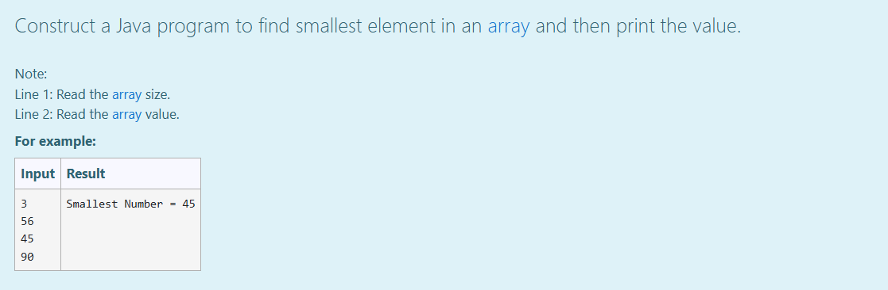
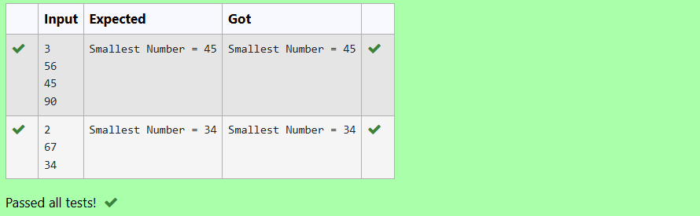

# Ex.No:2(E)  SMALLEST ELEMENT IN AN ARRAY

## AIM:
To construct a Java program that reads an array size and elements from the user and then finds smallest element in an array and then print the value.
## ALGORITHM :
1.	Start the program.
2.	Read the size of the array from the user.
3.	Declare an array of the given size.
4.	Read the array elements from the user.
5.	Initialize a variable `smallest` with the first element of the array.
6.	Traverse the array using a loop.
7.	Compare each element with min. If an element is smaller, update `smallest`.
8.	After the loop ends, print the smallest number.
9.	End the program.
	

## PROGRAM:
 ```
/*
Program to implement a Smallest Element in an Array
Developed by: Muhammad Afshan A
RegisterNumber: 212223100035
*/
```
## PROGRAM QUESTIONS AND SAMPLE INPUT:



## SOURCECODE.JAVA:

```
import java.util.*;
public class SmallArrayValue
{
    public static void main(String args[])
    {
        Scanner sc=new Scanner(System.in);
        int n=sc.nextInt();
        int arr[]=new int[n];
        for(int i=0;i<n;i++)
        {
            arr[i]=sc.nextInt();
        }
        int smallest=arr[0];
        for(int i=0;i<n;i++)
        {
            if(arr[i]<smallest)
            {
                smallest=arr[i];
            }
        }
        System.out.println("Smallest Number = "+smallest);
    }
}
```

## OUTPUT:



## RESULT:
Thus the java program successfully reads the array size and elements from the user and correctly finds and prints the smallest number in the array.


