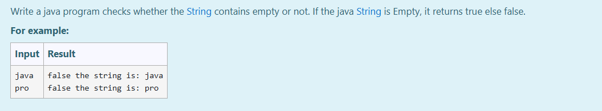
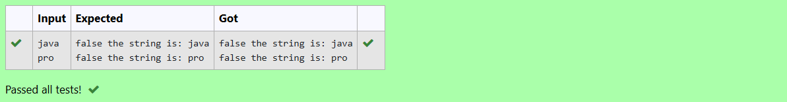

# Ex.No:3(A)  STRING AND ITS OPERATIONS IN JAVA

## AIM:

To write a Java program to check whether a given string is empty or not using built-in string methods.

## ALGORITHM:

1. Start the Program.
2. Import the `Scanner` class from `java.util`.
3. Define the main class as `prog`.
4. In the `main()` method:

   * a) Create a `Scanner` object named `sc` for user input.
   * b) Read two strings from the user using `sc.nextLine()` and store them in `str1` and `str2`.
5. Use the `isEmpty()` method to check if `str1` is empty:

   * If true, print `true`.
   * Else, print `false` and the value of the string.
6. Repeat the same check for `str2`.
7. End the Program.

## PROGRAM:

```
/*
Program to implement a String and its Operations using Java
Developed by: Muhammad Afshan A
RegisterNumber:  212223100035
*/
```

## PROGRAM QUESTION AND SAMPLE INPUT:



## SOURCECODE.JAVA:

```
import java.util.*;
public class prog
{
    public static void main(String[] args){
        Scanner sc= new Scanner(System.in);
        String str1= new String(sc.nextLine());
        String str2=new String (sc.nextLine());
        if(str1.isEmpty()){
            System.out.print("true");
        }
        else{
            System.out.println("false the string is: "+str1);
        }
        if(str2.isEmpty()){
            System.out.print("true");
        }
        else{
            System.out.println("false the string is: "+str2);
        }
    }
}
```

## OUTPUT:



## RESULT:

Thus, the Java program to check whether the input strings are empty using string operations was executed successfully.

