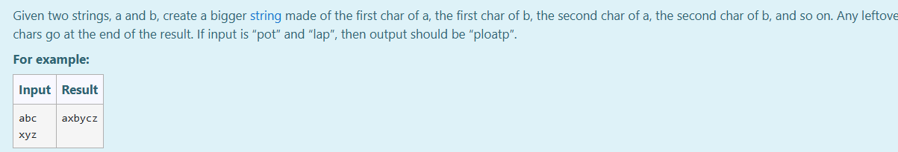
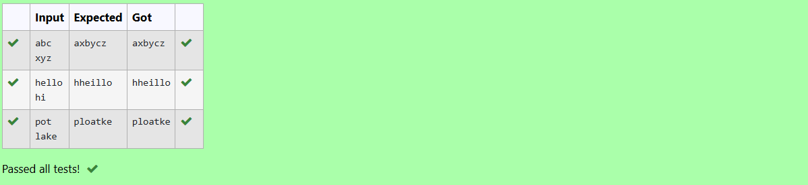

# Ex.No:3(B) STRING BUFFER IN JAVA

## AIM:

To write a Java program that, given two strings `a` and `b`, creates a new string by alternating characters from each and appending remaining characters at the end using the StringBuffer class.

## ALGORITHM :

1. Start the program.
2. Import `Scanner` class and define the class `Main`.
3. In the `main()` method:

   * a) Create a `Scanner` object `sc` to take input.
   * b) Read two strings `str1` and `str2` from user input.
4. Determine the longer and shorter string among `str1` and `str2`.
5. Create a `StringBuffer` object `Result` to store the merged string.
6. Loop through characters of the shorter string and append characters from both strings alternately to `Result`.
7. Append remaining characters from the longer string to `Result`.
8. Print the final result stored in `Result`.
9. End the program.

## PROGRAM:

```
/*
Program to implement a String Buffer using Java
Developed by: Muhammad Afshan A
RegisterNumber: 212223100035
*/
```

## PROGRAM QUESTION AND SAMPLE INPUT:



## SOURCECODE.JAVA:

```
import java.util.*;
public class Main{
    public static void main(String [] args){
        Scanner sc=new Scanner(System.in);
        String str1=sc.nextLine();
        String str2=sc.nextLine();
        String Big= (str1.length()>str2.length())?str1:str2;
        String Small= (str1.length()<str2.length())?str1:str2;
        StringBuffer Result=new StringBuffer();
       for(int i=0;i<Small.length();i++){
           Result.append(str1.charAt(i)).append(str2.charAt(i));
       }
        Result.append(Big.substring(Small.length(),Big.length()));
        System.out.println(Result);

    }
}
```

## OUTPUT:

## RESULT:

Thus the Java program that merges two strings using `StringBuffer` by alternating characters and appending leftovers was executed successfully.
