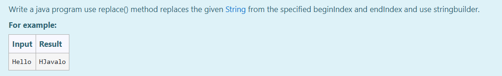
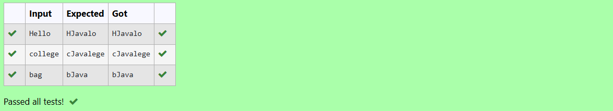

# Ex.No:3(C)    STRING BUILDER IN JAVA

## AIM:
To Write a java program using `replace()` method that replaces the given String from the specified `beginIndex` and `endIndex` using `StringBuilder`.

## ALGORITHM :
1. Start the Program
2. Import `Scanner` and define class `Main`
3. In `main`:
   - a) Create `Scanner` object `sc`
   - b) Read a string `str` from user input
4. Create a `StringBuilder` object `sb` initialized with `str`
5. Use the `replace()` method to replace characters from index 1 to 3 with "Java"
6. Print the modified string using `sb.toString()`
7. End

## PROGRAM:
```/*
Program to implement a String Builder using Java
Developed by: Muhammad Afshan A
RegisterNumber: 212223100035
*/
```

## PROGRAM QUESTION AND SAMPLE INPUT:


## SOURCECODE.JAVA:
```
import java.util.*;
public class Main{
    public static void main(String[] args){
        Scanner sc=new Scanner(System.in);
        String str=sc.nextLine();
        StringBuilder sb=new StringBuilder(str);
        int begin=1,end=3;
        sb.replace(begin,end,"Java");
        System.out.println(sb.toString());
    
    }
}
```
## OUTPUT:



## RESULT:
Thus the java program using replace() method to modify a given string using StringBuilder was executed successfully.