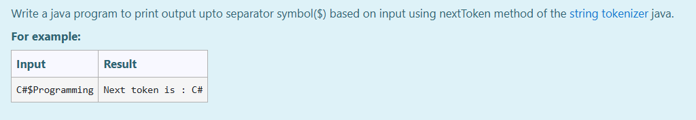
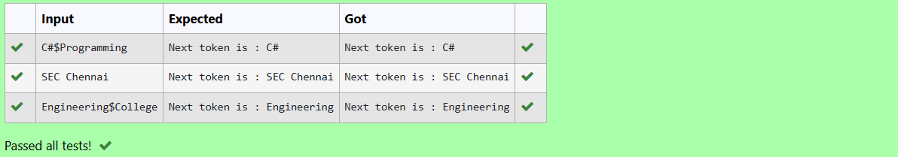

# Ex.No:3(D) STRING TOKENIZER IN JAVA

## AIM:
To write a Java program that prints the output up to the separator symbol (`$`) from user input using the `nextToken()` method of the `StringTokenizer` class.

## ALGORITHM :

1. Start the program.
2. Import the required classes: `Scanner` for user input and `StringTokenizer` for string tokenizing.
3. Define the class `Main`.
4. Inside the `main()` method:
   - a) Create a `Scanner` object `sc` to read user input.
   - b) Read a string input from the user into `str`.
5. Create a `StringTokenizer` object `st` with `str` and separator `$`.
6. Use `nextToken()` to get the token before the `$` separator.
7. Print the token to the console.
8. Close the scanner object (optional).
9. End the program.

## PROGRAM:
```

\*
Program to implement string tokenization based on a separator
Developed by: Muhammad Afshan A
RegisterNumber: 212223100035
*/

```

## PROGRAM QUESTION AND SAMPLE INPUT:

## SOURCECODE.JAVA:
```
import java.util.*;
public class Main{
    public static void main(String []args){
        Scanner sc=new Scanner(System.in);
        String str=sc.nextLine();
        StringTokenizer st=new StringTokenizer(str,"$");

        System.out.println("Next token is : "+st.nextToken());
    }
}
```

## OUTPUT:



## RESULT:
Thus, the Java program using `StringTokenizer` to tokenize a string based on the `$` separator and print the first token was executed successfully.
