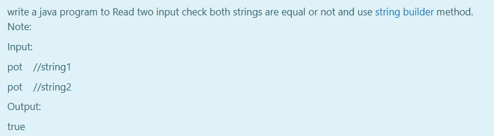

# Ex.No:3(E)  STRINGBUILDER OBJECT REFERENCE IN JAVA

## AIM:

To write a Java program to read two input strings, check whether both are equal or not, and use the `StringBuilder` class for comparison.

## ALGORITHM :

1. Start the program.
2. Import `Scanner` class and define the class `Main`.
3. In the `main()` method:

   * a) Create a `Scanner` object `sc` to read input.
   * b) Read two strings `str1` and `str2` from user input.
4. Create two `StringBuilder` objects `sb1` and `sb2` using `str1` and `str2` respectively.
5. Convert both `StringBuilder` objects to strings using `toString()` and compare them with `equals()` method.
6. Print `true` if both strings are equal, otherwise `false`.
7. End the program.

## PROGRAM:

```
/*
Program to implement a StringBuilder Object Reference in Java
Developed by: Muhammad Afshan A
RegisterNumber: 212223100035
*/
```

## PROGRAM QUESTION AND SAMPLE INPUT:


## SOURCECODE.JAVA:

```
import java.util.*;
public class Main{
    public static void main(String[] args){
        Scanner sc=new Scanner(System.in);
        String str1=sc.nextLine();
        String str2=sc.nextLine();
        StringBuilder sb1=new StringBuilder(str1);
        StringBuilder sb2=new StringBuilder(str2);
        System.out.println(sb1.toString().equals(sb2.toString()));
    }
}
```

## OUTPUT:


## RESULT:

Thus the Java program successfully reads two strings, creates `StringBuilder` objects using them, and compares their contents using object references and `toString()` method.
