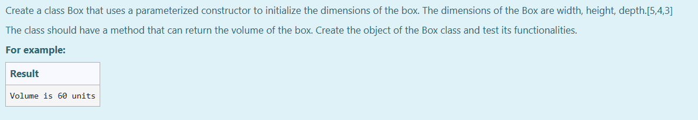

# Ex.No:4(A)  JAVA CONSTRUCTOR

## AIM:

To Create a class Box that uses a parameterized constructor to initialize the dimensions of the box. The dimensions of the Box are width, height, depth.[5,4,3],The class should have a method that can return the volume of the box. Create the object of the Box class and test its functionalities.

## ALGORITHM :

1. Start the Program.
2. Define a class `Box`.
3. Inside the class, declare integer variables `height`, `width`, and `depth`.
4. Create a parameterized constructor `Box(int h, int w, int d)` to initialize the dimensions.
5. Define a method `volume()` to calculate and return the volume as `height * width * depth`.
6. In `main`, create an object of `Box` with dimensions (5, 4, 3).
7. Call the `volume()` method and print the volume.
8. End.

## PROGRAM:

```
/*
Program to implement a Constructor using Java
Developed by: Muhammad Afshan A
RegisterNumber: 212223100035
*/
```

## PROGRAM QUESTION AND SAMPLE INPUT:

## SOURCECODE.JAVA:

```
public class Box
{
     int height,width,depth;

    Box(int h,int w,int d)
    {
        height=h;
        width=w;
        depth=d;

    }
    int volume()
    {
        return height*depth*width;

    }

public static void main(String[] args)
{
   Box obj=new Box(5,4,3);
   int vol=obj.volume();
   System.out.println("Volume is "+vol+" units");
}
}
```

## OUTPUT:

## RESULT:

Thus the Java program using constructor to calculate and print the volume of the box was executed successfully.
