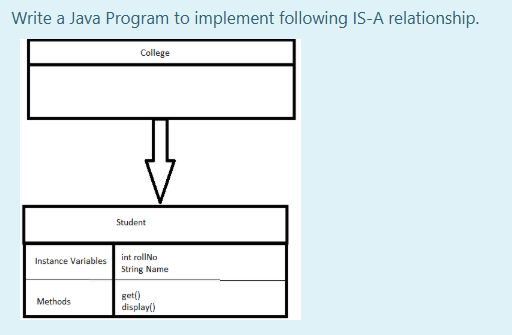
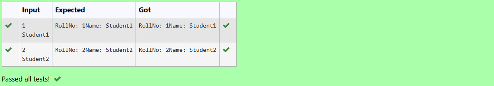

# Ex.No:4(B) INTRODUCTION TO JAVA INHERITANCE

## AIM:

To create a Java program to perform the inheritance concept and implement following IS-A relationship for student details.

## ALGORITHM :

1. Start the Program
2. Define class `College` as the base class
3. Define class `Student` that extends `College`

   * a) Declare `rollNo` and `name` as instance variables
   * b) Define method `get(int rollNo, String name)` to initialize these variables
   * c) Define method `display()` to print `rollNo` and `name`
4. In the `main` method of class `Main`:

   * a) Create a `Student` object `s1`
   * b) Use `Scanner` to input `rollNo` and `name`
   * c) Call `get()` method to set values
   * d) Call `display()` method to show student details
5. End

## PROGRAM:

```
/*
Program to implement a Inheritance using Java
Developed by: Muhammad Afshan A
RegisterNumber: 212223100035
*/
```

## PROGRAM QUESTION AND SAMPLE INPUT:


## SOURCECODE.JAVA:

```
import java.util.*;
class College {
   
}
class Student extends College {
    int rollNo;
    String name;
    void get(int rollNo, String name) {
        this.rollNo = rollNo;
        this.name = name;
    }

    void display() {
        System.out.print("RollNo: " + rollNo);
        System.out.println("Name: " + name);
    }
}

public class Main {
    public static void main(String[] args) {
        Student s1 = new Student();
        Scanner sc=new Scanner(System.in);
        s1.rollNo=sc.nextInt();
        s1.name=sc.next();
        s1.get(s1.rollNo,s1.name);
        s1.display();
    }
}
```

## OUTPUT:

## RESULT:
Thus the Java program to implement the inheritance concept for student details was executed successfully.
