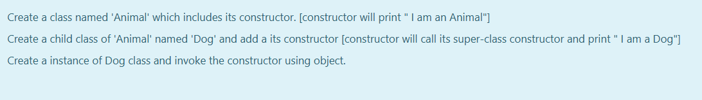

# Ex.No:4(C)    CONSTRUCTOR CHAINING(SUPER KEYWORD)

## QUESTION :
* Create a class named 'Animal' which includes its constructor. [constructor will print " I am an Animal"]
* Create a child class of 'Animal' named 'Dog' and add a its constructor [constructor will call its super-class constructor and print " I am a Dog"] 
* Create a instance of Dog class and invoke the constructor using object.
## AIM:
To Create a Java program to implement super keyword in constructor.

## ALGORITHM :

1. Start the Program
2. Define class `Animal`:

   * a) Define a constructor that prints "I am an animal"
3. Define class `Dog` that extends `Animal`:

   * a) In the constructor, call `super()` to invoke the superclass constructor
   * b) Print "I am a dog"
4. In the `main` method of class `Main`:

   * a) Create a `Dog` object `obj`
5. End

## PROGRAM:

```
/*
Program to implement a Constructor Chaining using Java
Developed by: Muhammad Afshan A
RegisterNumber: 212223100035
*/
```

## PROGRAM QUESTION AND SAMPLE INPUT:


## SOURCECODE.JAVA:

```
class Animal {
    Animal() {
        System.out.println("I am an animal");
    }
}

class Dog extends Animal {
    Dog() {
        super();
        System.out.println("I am a dog");
    }
}

public class Main {
    public static void main(String[] args) {
        Dog obj = new Dog();
    }
}
```

## OUTPUT:


## RESULT:

Thus the Java program for constructor chaining was executed successfully.
