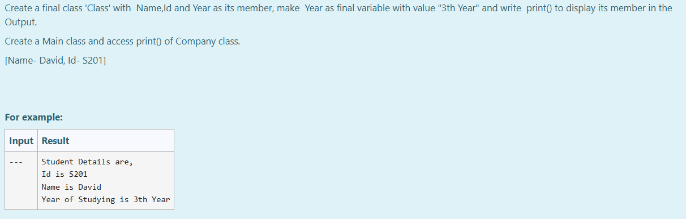

# Ex.No:4(D) FINAL & STATIC IN JAVA

## AIM:

To Create a final class 'Class' with  Name, Id and Year as its member, make  Year as final variable with value "3th Year" and write  print() to display its member in the Output.

*Note:*
Create a Main class and access print() of Company class.<br>
[Name- David, Id- S201]

## ALGORITHM :

1. Start the Program.
2. Define a final class `Sclass`:

   * a) Declare String variables `Name`, `Id` and a final variable `Year`.
   * b) Assign values: Name = "David", Id = "S201", Year = "3th Year".
   * c) Define a method `print()` to print all the member variables.
3. In the `Main` class:

   * a) Create an object of `Sclass`.
   * b) Call `print()` method.
4. End

## PROGRAM:

```
/*
Program to implement a final & Static using Java
Developed by: Muhammad Afshan A
RegisterNumber: 212223100035
*/
```

## PROGRAM QUESTION AND SAMPLE INPUT:


## SOURCECODE.JAVA:

```
final class Sclass {
    String Name = "David";
    String Id = "S201";
    final String Year = "3th Year";
    
    void print() {
        System.out.print("Student Details are,\nId is " + Id + "\nName is " + Name + "\nYear of Studying is " + Year);
    }
}

public class Main {
    public static void main(String[] args) {
        Sclass obj = new Sclass();
        obj.print();
    }
}
```

## OUTPUT:


## RESULT:

Thus, the Java program to perform final & static keyword was executed successfully.
