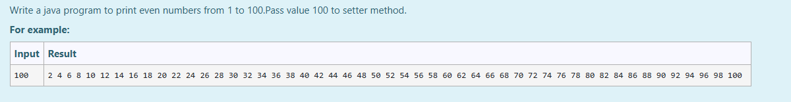

# Ex.No:5(A)  DATA HIDING AND ENCAPSULATION

## AIM:

To Write a java program to print even numbers from 1 to 100. Pass value 100 to setter method, use the encapsulation concepts.

## ALGORITHM :

1. Start the program
2. Define class `Num`:
   - a) Declare a private integer variable `num`
   - b) Define `setNum(int N)` method to set the value of `num`
   - c) Define `getNum()` method to return the value of `num`
3. Define `Main` class with `main` method:
   - a) Create `Scanner` object `sc` for input
   - b) Read a number from user input
   - c) Create `Num` object `obj`
   - d) Use `obj.setNum(value)` to store the number
   - e) Use `obj.getNum()` and loop from 1 to that number, printing even numbers
4. End

## PROGRAM:

```
/*
Program to implement a Data Hiding & Encapsulation using Java
Developed by: Muhammad Afshan A
RegisterNumber: 212223100035
*/
```

## PROGRAM QUESTION AND SAMPLE INPUT:


## SOURCECODE.JAVA:

```
import java.util.*;
class Num {
    private int num;

    public int getNum() {
        return num;
    }

    public void setNum(int N) {
        num = N;
    }
}

public class Main {
    public static void main(String args[]) {
        Num obj = new Num();
        Scanner sc = new Scanner(System.in);
        int A = sc.nextInt();
        obj.setNum(A);
        int get = obj.getNum();
        for (int i = 1; i <= get; i++) {
            if (i % 2 == 0) {
                System.out.print(i + " ");
            }
        }
    }
}
```

## OUTPUT:


## RESULT:

Thus, the Java program to print even numbers using encapsulation was executed successfully.
