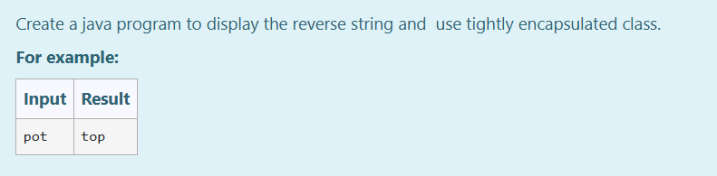

# Ex.No:5(B) TIGHTLY ENCAPSULATED CLASS

## AIM:

To create a Java program to display the reverse of a string and use a tightly encapsulated class.

## ALGORITHM :

1. Start the program
2. Define `SetAndGet` class:

   * a) Declare a private variable `str`
   * b) Provide `setName(String Name)` method to set the value of `str`
   * c) Provide `getName()` method to return `str`
3. Define `Main` class with `main` method:

   * a) Create a `Scanner` object
   * b) Read a string input from the user
   * c) Create an instance of `SetAndGet` and use `setName()` to store the string
   * d) Convert the string to a character array
   * e) Print the characters in reverse order
4. End

## PROGRAM:

```
/*
Program to implement a tightly encapsulated class using Java
Developed by: Muhammad Afshan A
RegisterNumber: 212223100035
*/
```

## PROGRAM QUESTION AND SAMPLE INPUT:


## SOURCECODE.JAVA:

```
import java.util.*;

class SetAndGet {
    private String str;

    public String getName() {
        return str;
    }

    public void SetName(String Name) {
        str = Name;
    }
}

public class Main {
    public static void main(String[] args) {
        Scanner sc = new Scanner(System.in);
        SetAndGet obj = new SetAndGet();
        String name = sc.next();
        obj.SetName(name);
        char[] c = obj.getName().toCharArray();
        for (int i = c.length - 1; i >= 0; i--) {
            System.out.printf("%c", c[i]);
        }
    }
}
```

## OUTPUT:


## RESULT:
Thus, the Java program to reverse a string using a tightly encapsulated class was executed successfully.
