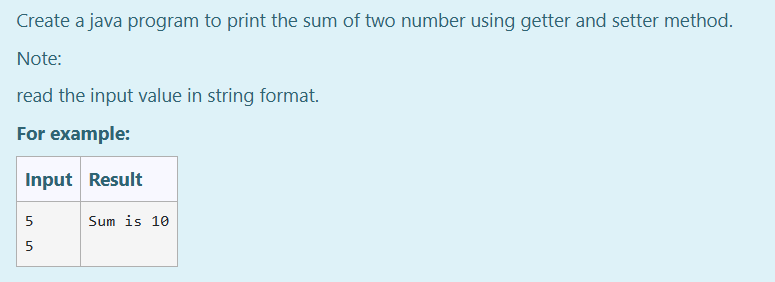

# Ex.No:5(C)    GETTER AND SETTER METHOD

## AIM:

To create a Java program to print the sum of two numbers using getter and setter methods.

## ALGORITHM :

1. Start the Program
2. Define class `prog`:

   * a) Declare private integer variables `a` and `b`
   * b) Define method `set(int x, int y)` to set the values of `a` and `b`
   * c) Define method `get()` to return the sum of `a` and `b`
3. In the `main` method:

   * a) Create a `Scanner` object to read two integer values
   * b) Create an object of class `prog`
   * c) Use `set()` method to pass values
   * d) Use `get()` method to calculate and print the result
4. End

## PROGRAM:

```
/*
Program to implement a Getter and Setter using Java
Developed by: Muhammad Afshan A
RegisterNumber: 212223100035
*/
```

## PROGRAM QUESTION AND SAMPLE INPUT:


## SOURCECODE.JAVA:

```
import java.util.*;

public class prog {
    private int a, b;

    int get() {
        return a + b;
    }

    void set(int x, int y) {
        a = x;
        b = y;
    }

    public static void main(String[] args) {
        Scanner sc = new Scanner(System.in);
        prog p = new prog();
        int s = sc.nextInt();
        int q = sc.nextInt();
        p.set(s, q);
        int r = p.get();
        System.out.println("Sum is " + r);
    }
}
```

## OUTPUT:


## RESULT:
Thus, the Java program to print the sum of two numbers using getter and setter methods was executed successfully.
