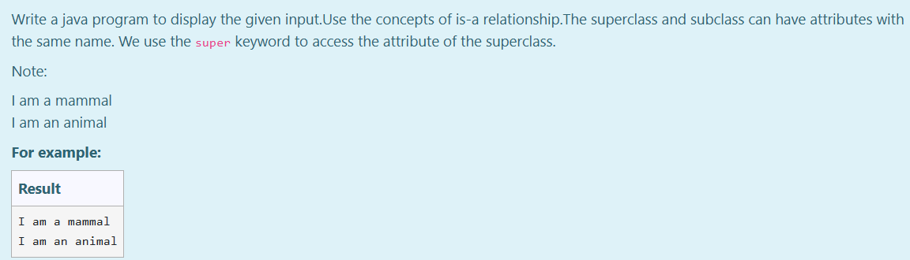

# Ex.No:5(D) IS-A RELATIONSHIP AND HAS-A RELATIONSHIP

## AIM:

To write a Java program to display the given input using the concepts of IS-A relationship. The superclass and subclass can have attributes with the same name. 
- We use the `super` keyword to access the attribute of the superclass.
* Note: Output should include:

   * I am a mammal
   * I am an animal

## ALGORITHM :

1. Start the Program
2. Define superclass `Animal`:

   * a) Declare a protected String variable `type` and assign it the value `"animal"`
3. Define subclass `Dog` which **IS-A** type of `Animal`:

   * a) Declare a public String variable `type` and assign it the value `"mammal"`
   * b) Create method `printType()` to:

     * i) Print the local `type`
     * ii) Use `super.type` to access the superclass attribute
4. In the `main` method of the `Main` class:

   * a) Create an object of class `Dog`
   * b) Call the `printType()` method
5. End

## PROGRAM:

```
/*
Program to implement a IS-A RELATIONSHIP AND HAS-A RELATIONSHIP using Java  
Developed by: Muhammad Afshan A  
RegisterNumber: 212223100035  
*/
```

## PROGRAM QUESTION AND SAMPLE INPUT:


## SOURCECODE.JAVA:

```
class Animal {
  protected String type = "animal";
}

class Dog extends Animal {
  public String type = "mammal";
  public void printType() {
    System.out.println("I am a " + type);
    System.out.println("I am an " + super.type);
  }
}

public class Main {
  public static void main(String[] args) {
    Dog dog1 = new Dog();
    dog1.printType();
  }
}
```

## OUTPUT:


## RESULT:

Thus, the Java program to demonstrate IS-A and HAS-A relationship using `super` keyword was executed successfully.
