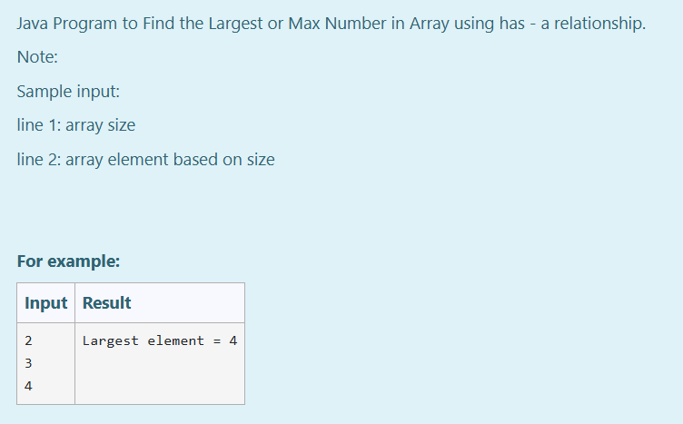
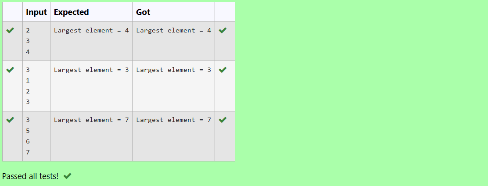

# Ex.No:5(E) HAS-A RELATIONSHIP

## AIM:

To implement a Java program to find the largest or maximum number in an array using HAS-A relationship.

## ALGORITHM :

1. Start the program.
2. Create a class `ArrayData`:

   * a) Declare an integer array and a variable for size.
   * b) Create a method to set the array elements.
3. Create another class `ArrayOperation`:

   * a) Create a method `findMax()` that accepts an `ArrayData` object.
   * b) Loop through the array to find the largest element.
4. In the `main()` method of class `Main`:

   * a) Create an object of `ArrayData` and read input.
   * b) Create an object of `ArrayOperation` and call `findMax()` by passing the `ArrayData` object.
5. Display the largest number.
6. End the program.

## PROGRAM:

```
/*
Program to implement a HAS-A Relationship
Developed by: Muhammad Afshan A
RegisterNumber: 212223100035
*/
```

## PROGRAM QUESTION AND SAMPLE INPUT:


## SOURCECODE.JAVA:

```
import java.util.*;

class ArrayData {
    private int[] num;

    public void setArray(int[] arr) {
        num = arr;
    }

    public int[] getArray() {
        return num;
    }
}

class ArrayOperation {
    public int findMax(ArrayData data) {
        int[] arr = data.getArray();
        int max = arr[0];
        for (int i = 1; i < arr.length; i++) {
            if (arr[i] > max) {
                max = arr[i];
            }
        }
        return max;
    }
}

public class Main {
    public static void main(String[] args) {
        Scanner sc = new Scanner(System.in);
        int n = sc.nextInt();
        int[] inputArray = new int[n];
        for (int i = 0; i < n; i++) {
            inputArray[i] = sc.nextInt();
        }

        ArrayData data = new ArrayData();
        data.setArray(inputArray);

        ArrayOperation op = new ArrayOperation();
        int result = op.findMax(data);

        System.out.println("Largest element = " + result);
    }
}
```

## OUTPUT:


## RESULT:
Thus, the Java program to find the largest or maximum number in an array using HAS-A relationship was executed successfully.
