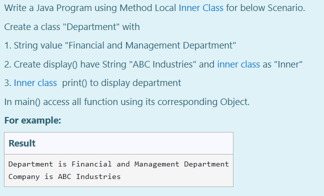

# Ex.No:6(A)  INNER CLASS
## QUESTION:
Write a Java Program using Method Local Inner Class for below Scenario.
Create a class "Department" with
1. String value "Financial and Management Department"
2. Create display() have String "ABC Industries" and inner class as "Inner"
3. Inner class  print() to display department
- In main() access all function using its corresponding Object.
## AIM:
To create a Java Program to implement Method Local Inner Class.

## ALGORITHM :
1. Start the Program.
2. Define outer class `Department`:

   * a) Declare a `String` variable `UN` and initialize it with "Financial and Management Department".
   * b) Define method `display()`:

     * i) Declare a `String` variable `str = "ABC Industries"`.
     * ii) Define a method-local inner class `Inner` with a method `print()` that prints `UN` and `str`.
     * iii) Create an object of `Inner` and call `print()`.
3. In the `main` method of `Department` class:

   * a) Create an object of `Department`.
   * b) Call the `display()` method.
4. End.

## PROGRAM:

```
/*
Program to implement a Inner Class using Java
Developed by: Muhammad Afshan A
RegisterNumber: 212223100035
*/
```

## PROGRAM QUESTION AND SAMPLE INPUT:


## SOURCECODE.JAVA:
```
public class Department {
    String UN = "Financial and Management Department";

    void display() {
        String str = "ABC Industries";
        
        class Inner {
            public void print() {
                System.out.println("Department is " + UN);
                System.out.println("Company is " + str);
            }
        }
        
        Inner obj = new Inner();
        obj.print();
    }

    public static void main(String[] args) {
        Department Dep = new Department();
        Dep.display();
    }
}
```

## OUTPUT:


## RESULT:
Thus, the Java Program using Method Local Inner Class was executed successfully .