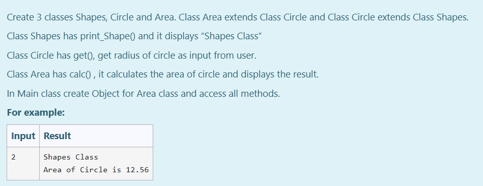

# Ex.No:6(B) MULTI-LEVEL INHERITANCE
## QUESTION:
Create 3 classes Shapes, Circle and Area. Class Area extends Class Circle and Class Circle extends Class Shapes.
<br>
Class Shapes has print_Shape() and it displays “Shapes Class”
<br>
Class Circle has get(), get radius of circle as input from user.
<br>
Class Area has calc() , it calculates the area of circle and displays the result.
<br>
In Main class create Object for Area class and access all methods.

## AIM:
To Develop a Java program to perform Multilevel Inheritance to calculate the area of circle.

## ALGORITHM:

1. Start the Program.
2. Define class `Shapes`:

   * a) Method `print_shape()` to print "Shapes Class".
3. Define class `Circle` that extends `Shapes`:

   * a) Declare integer `rad`.
   * b) Method `get()` to read `rad` from user input.
4. Define class `area` that extends `Circle`:

   * a) Method `calc()` to calculate `result = 3.14 * rad * rad` and print "Area of Circle is " followed by `result`.
5. In `prog` class `main` method:

   * a) Create `area` object `a`.
   * b) Call `calc()` on `a` to display shape type, read radius, and calculate area.
6. End.

## PROGRAM:

```
/*
Program to implement a MultiLevel Inheritance using Java
Developed by: Muhammad Afshan A
RegisterNumber: 212223100035
*/
```

## PROGRAM QUESTION AND SAMPLE INPUT:


## SOURCECODE.JAVA:

```
import java.util.*;

class Shapes {
    void print_shape() {
        System.out.println("Shapes Class");
    }
}

class Circle extends Shapes {
    int get() {
        super.print_shape();
        Scanner sc = new Scanner(System.in);
        int r = sc.nextInt();
        return r;
    }
}

class area extends Circle {
    void calc() {
        int r = super.get();
        double a = 3.14 * r * r;
        System.out.println("Area of Circle is " + a);
    }
}

public class prog {
    public static void main(String[] args) {
        area a = new area();
        a.calc();
    }
}
```

## OUTPUT :


## RESULT :
Thus the Java program for multi-level inheritance was executed successfully.
