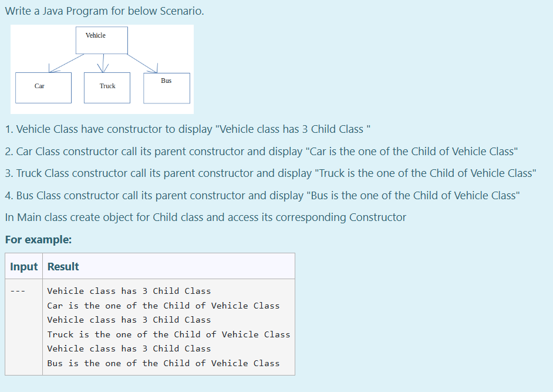
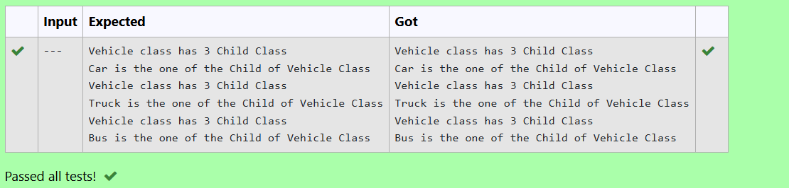

# Ex.No:6(C) HIERARCHICAL INHERITANCE

## AIM:

To Develop a Java program to perform Hierarchical Inheritance for below scenario:

1. Vehicle Class has constructor to display "Vehicle class has 3 Child Class"
2. Car Class constructor calls its parent constructor and displays "Car is one of the Child of Vehicle Class"
3. Truck Class constructor calls its parent constructor and displays "Truck is one of the Child of Vehicle Class"
4. Bus Class constructor calls its parent constructor and displays "Bus is one of the Child of Vehicle Class"

* In Main class, create object for each Child class and access its corresponding Constructor.

## ALGORITHM :

1. Start the Program
2. Define class `Vehicle`:

   * a) Constructor prints "Vehicle class has 3 Child Class"
3. Define class `Car` that extends `Vehicle`:

   * a) Constructor calls `super()` and prints "Car is one of the Child of Vehicle Class"
4. Define class `Truck` that extends `Vehicle`:

   * a) Constructor calls `super()` and prints "Truck is one of the Child of Vehicle Class"
5. Define class `Bus` that extends `Vehicle`:

   * a) Constructor calls `super()` and prints "Bus is one of the Child of Vehicle Class"
6. In `main` method:

   * a) Create object of `Car`, `Truck`, and `Bus`
7. End

## PROGRAM:

```
/*
Program to implement a Hierarchical Inheritance using Java
Developed by: Muhammad Afshan A
RegisterNumber: 212223100035
*/
```

## PROGRAM QUESTION AND SAMPLE INPUT:


## SOURCECODE.JAVA:

```
class Vehicle {
    Vehicle() {
        System.out.println("Vehicle class has 3 Child Class");
    }
}

class Car extends Vehicle {
    Car() {
        super();
        System.out.println("Car is one of the Child of Vehicle Class");
    }
}

class Bus extends Vehicle {
    Bus() {
        super();
        System.out.println("Bus is one of the Child of Vehicle Class");
    }
}

class Truck extends Vehicle {
    Truck() {
        super();
        System.out.println("Truck is one of the Child of Vehicle Class");
    }
}

public class prog {
    public static void main(String[] args) {
        Car c = new Car();
        Truck t = new Truck();
        Bus b = new Bus();
    }
}
```

## OUTPUT:


## RESULT :

Thus the Java program for Hierarchical inheritance was executed successfully.
