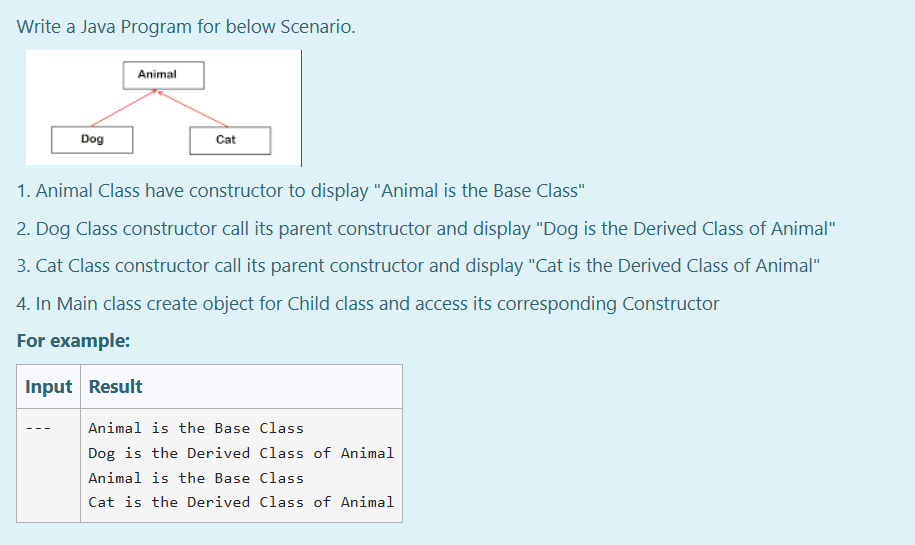

# Ex.No:6(E) HIERARCHICAL INHERITANCE 2

## QUESTION:
Write a Java Program for below Scenario:

1. Animal Class have constructor to display "Animal is the Base Class"

2. Dog Class constructor call its parent constructor and display "Dog is the Derived Class of Animal"

3. Cat Class constructor call its parent constructor and display "Cat is the Derived Class of Animal"

4. In Main class create object for Child class and access its corresponding Constructor

---
## AIM:
To write a Java program to demonstrate **hierarchical inheritance**, where multiple classes inherit from a single base class.

## ALGORITHM :
1. Start the program.
2. Define a base class named `Animal`.
3. Inside the `Animal` class, create a constructor that prints a message indicating it's the base class.
4. Define a derived class named `Dog` that `extends` the `Animal` class.
5. Inside the `Dog` class, create a constructor that calls the base class constructor using `super()` and then prints a message indicating it's a derived class of `Animal`.
6. Define another derived class named `Cat` that also `extends` the `Animal` class.
7. Inside the `Cat` class, create a constructor that calls the base class constructor using `super()` and then prints a message indicating it's a derived class of `Animal`.
8. In the `Main` class's `main()` method:
    a. Create an object of the `Dog` class.
    b. Create an object of the `Cat` class.
9. End the program.

## PROGRAM:
```
/*
Program to implement Hierarchical Inheritance in Java
Developed by: Muhammad Afshan A
RegisterNumber: 212223100035
*/
```

## PROGRAM QUESTION AND SAMPLE INPUT:


## SOURCECODE.JAVA:
```
import java.util.*;
class Animal{
    public Animal(){
        System.out.println("Animal is the Base Class");
    };
}
class Dog extends Animal{
    public Dog(){
        super();
        System.out.println("Dog is the Derived Class of Animal");
    };
}
class Cat extends Animal{
    public Cat(){
        super();
        System.out.println("Cat is the Derived Class of Animal");
    };
}
public class Main{
    public static void main(String args[]){
        Dog d=new Dog();
        Cat c=new Cat();
    }
}
```

---

## OUTPUT:


## RESULT:
Thus, the Java program successfully demonstrates **hierarchical inheritance** by showing how multiple derived classes can inherit from a single base class.