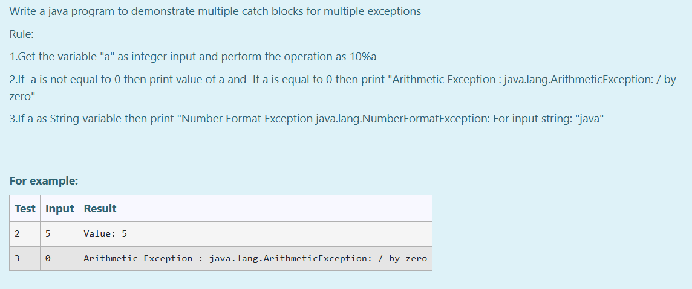
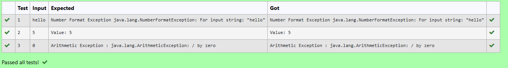

# Ex.No:7(A)           EXCEPTION HANDLING-RUN TIME EXCEPTION

## QUESTION:
Write a java program to demonstrate multiple catch blocks for multiple exceptions
<br>
Rule:
<br>
1.Get the variable "a" as integer input and perform the operation as 10%a
<br>
2.If  a is not equal to 0 then print value of a and  If a is equal to 0 then print "Arithmetic Exception : java.lang.ArithmeticException: / by zero"
<br>
3.If a as String variable then print "Number Format Exception java.lang.NumberFormatException: For input string: "java"

## AIM:
To Develop a Java Program for handling Arithmetic Exception (division by zero exception) using Exception Handling Mechanism.

## ALGORITHM :
1. Start the Program
2. Import `java.util.*` for input handling
3. Define class `HelloWorld`:

   * a) In `main` method, create `Scanner` object `sc` for input
4. Use `try` block to:

   * a) Read a string input
   * b) Parse the string to integer `a`
   * c) Calculate `10 % a` and print the result
5. Use `catch` blocks to handle exceptions:

   * a) `ArithmeticException`: if division by zero occurs
   * b) `NumberFormatException`: if the input is not a valid number
   * c) `Exception`: to catch any other type of exception
6. End

## PROGRAM:

```
/*
Program to implement a Exception Handling-Run Time Exception using Java  
Developed by: Muhammad Afshan A  
RegisterNumber: 212223100035  
*/
```

## PROGRAM QUESTION AND SAMPLE INPUT:



## SOURCECODE.JAVA:

```
import java.util.Scanner;

public class HelloWorld {
    public static void main(String[] args)
    {
        Scanner sc = new Scanner(System.in);
        String str = sc.nextLine();    

        try {
            int a = Integer.parseInt(str);
            int result = 10 % a;
            System.out.println("Value: " + a);
        } catch (ArithmeticException e) {
            System.out.println("Arithmetic Exception : java.lang.ArithmeticException: / by zero");
        } catch (NumberFormatException e) {
            System.out.printf("Number Format Exception java.lang.NumberFormatException: For input string: \"%s\"", str);
        } catch (Exception e) {
            System.out.println("Class Error");
        }
    }
}
```

## OUTPUT :


## RESULT :
Thus the Java Program for handling Arithmetic Exception (division by zero exception) using Exception Handling Mechanism was executed successfully .