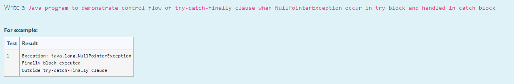

# Ex.No:7(B) EXCEPTION HANDLING-FINALLY

## AIM:
To Write a Java program to demonstrate control flow of try-catch-finally clause when NullPointerException occurs in try block and is handled in catch block.

## ALGORITHM :
1. Start the Program
2. Define class `HelloWorld`

   * a) In `main()` method, declare a string `s` and assign it as `null`
3. Use `try` block to:

   * a) Attempt to call `s.length()` which throws a `NullPointerException`
4. Use `catch` block to:

   * a) Catch the `Exception` and print the exception message
5. Use `finally` block to:

   * a) Print "Finally block executed"
6. After the `try-catch-finally` block, print "Outside try-catch-finally clause"
7. End the program

## PROGRAM:

```
/*
Program to implement a Exception Handling-Finally using Java  
Developed by: Muhammad Afshan A  
RegisterNumber: 212223100035  
*/
```

## PROGRAM QUESTION AND SAMPLE INPUT:


## SOURCECODE.JAVA:

```
public class HelloWorld {
    public static void main(String[] args) 
    {
        String s = null;

        try {
            System.out.println(s.length());
        } catch (Exception e) {
            System.out.println("Exception: " + e);
        } finally {
            System.out.println("Finally block executed");
        }

        System.out.println("Outside try-catch-finally clause");
    }
}
```

## OUTPUT:


## RESULT :
Thus the Java program to demonstrate control flow of try-catch-finally clause when NullPointerException occurs in try block and is handled in catch block was executed successfully.
