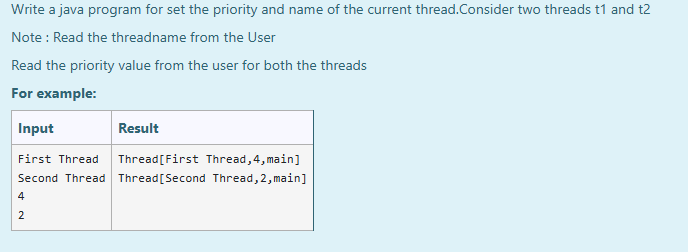
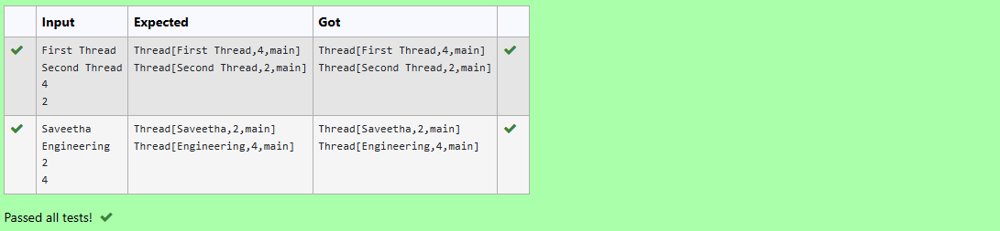

# Ex.No:7(C) THREAD IN JAVA

## AIM:
To Write a java program for set the priority and name of the current thread. Consider two threads t1 and t2

* Note: Read the thread name from the user

* Read the priority value from the user for both the threads\*

## ALGORITHM :
1. Start the Program
2. Import necessary classes: `java.util.*`
3. Define a class `A` that implements `Runnable`:

   * a) Override the `run()` method
   * b) Print the current thread using `Thread.currentThread()`
4. In the `main()` method:

   * a) Create a `Scanner` object for input
   * b) Read two thread names from the user
   * c) Read priority values for both threads
   * d) Create two `Thread` objects `t1` and `t2` with given names
   * e) Set the priority for both threads
   * f) Start both threads
5. End

## PROGRAM:

```
/*
Program to implement a Thread concepts using Java
Developed by: Muhammad Afshan A
RegisterNumber: 212223100035
*/
```

## PROGRAM QUESTION AND SAMPLE INPUT:


## SOURCECODE.JAVA:

```
import java.util.*;

public class A implements Runnable {
    public void run() {
        System.out.println(Thread.currentThread());
    }

    public static void main(String[] args) {
        A a = new A();
        Scanner sc = new Scanner(System.in);

        String first = sc.nextLine();
        String second = sc.nextLine();

        int p1 = sc.nextInt();
        int p2 = sc.nextInt();

        Thread t1 = new Thread(a, first);
        Thread t2 = new Thread(a, second);

        t1.setPriority(p1);  
        t2.setPriority(p2);

        t1.start();
        t2.start();
    }
}
```

---
## OUTPUT:


## RESULT :
Thus the Java program for the creation of Thread using Thread class was executed successfully .