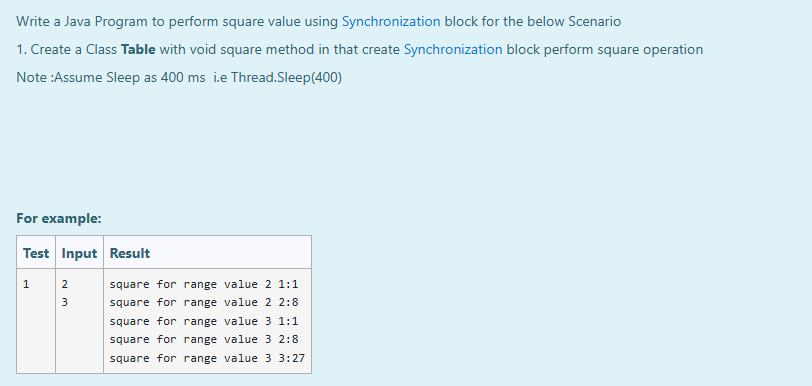

# Ex.No:7(D) SYNCHRONIZATION

## AIM:
To Develop a Java Program to perform static synchronization method for the below Scenario:
1. Create a Class Table with void square method in that create Synchronization block perform square operation
* **Note:** Assume Sleep as 400 ms i.e., `Thread.sleep(400)`

## ALGORITHM :
1. Start the Program
2. Define a class `Table`

   * a) Create method `square(int n)`
   * b) Within the method, add `synchronized(this)` block
   * c) Inside the synchronized block, loop from 1 to `n` and print the square of each value
   * d) Use `Thread.sleep(400)` inside `try-catch` block to simulate delay
3. Create thread classes if needed to invoke the `square` method concurrently (not shown in snippet)
4. End

## PROGRAM:
```
/*
Program to implement a Packages using Java
Developed by: Muhammad Afshan A
RegisterNumber: 212223100035
*/
```
## PROGRAM QUESTION AND SAMPLE INPUT:


## SOURCECODE.JAVA:

```
class Table
    {  
       void square(int n)
       {
           synchronized(this){
               for(int i=1;i<=n;i++){
                   System.out.println("square for range value "+n+" "+i+":"+i*i*i);
               }
           }
           try{
               Thread.sleep(400);
           }
           catch(Exception e){
               System.out.println(e);
           }
       }
             
    }
```
---
## OUTPUT:


## RESULT:
Thus the java program for synchronization was executed successfully .
