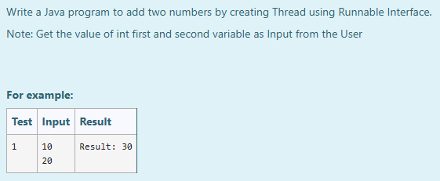

# Ex.No:7(E) THREAD CREATION USING RUNNABLE INTERFACE

## AIM:
To write a Java program to create a new thread by implementing the `Runnable` interface and use it to read two integer inputs from the user and display their sum.

* Note: Get the value of int first and second variable as Input from the User

## ALGORITHM :
1. Start the program.
2. Define a class, `Multi`, that **implements the `Runnable` interface**.
3. Override the `run()` method within the `Multi` class:
    a. Inside `run()`, create a `Scanner` object to read input.
    b. Read the first integer input from the user and store it in variable `a`.
    c. Read the second integer input from the user and store it in variable `b`.
    d. Calculate the sum of `a` and `b`, storing it in variable `c`.
    e. Print the calculated `Result: ` followed by the sum `c`.
4. In the `main()` method of the `Multi` class:
    a. Create an instance of the `Multi` class (which implements `Runnable`).
    b. Create a `Thread` object, passing the `Multi` instance to its constructor.
    c. Start the execution of the new thread by calling the `start()` method on the `Thread` object.
5. End the program.

## PROGRAM:
```
/*
Program to implement Thread Creation using Runnable Interface in Java
Developed by: Muhammad Afshan A
RegisterNumber: 212223100035
*/
```
## PROGRAM QUESTION AND SAMPLE INPUT:


## SOURCECODE.JAVA:

```
import java.util.*;
public class Multi implements Runnable
{  
    public void run()
    {
        Scanner sc=new Scanner(System.in);  
        int a=sc.nextInt();
        int b=sc.nextInt();
        int c=a+b;
        System.out.print("Result: "+c);     
    }
        
    public static void main(String args[])
    {  
        Multi m=new Multi();
        Thread obj = new Thread(m);
        obj.start();
     
    }  
}   
```

---

## OUTPUT:


## RESULT:
Thus, the Java program successfully demonstrates thread creation by implementing the `Runnable` interface, reading two numbers from the user, and displaying their sum within a separate thread.