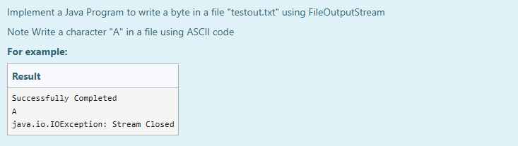

# Ex.No:8(A)           IO-FILE STREAM

## AIM:
To Implement a Java Program to write a byte in a file "testout.txt" using FileOutputStream
*Note: Write a character "A" in a file using ASCII code*

## ALGORITHM :
1. Define the character `'A'` to be written.
2. Use `FileOutputStream` to create/open the file `testout.txt`.
3. Write the ASCII value of `'A'` into the file using `fout.write()`.
4. Close the stream after writing.
5. Print success message.
6. Handle exceptions appropriately.

## PROGRAM:

```
/*
Program to implement a IO File Stream using Java
Developed by: Muhammad Afshan A
RegisterNumber: 212223100035
*/
```

## PROGRAM QUESTION AND SAMPLE INPUT:


## SOURCECODE.JAVA:

```
import java.io.*;

public class FileWriteDemo {
    public static void main(String[] args) {
        try {
            char c = 'A';
            FileOutputStream fout = new FileOutputStream("testout.txt");
            fout.write(c);
            fout.close();
            System.out.println("Successfully Completed");
        } catch (Exception e) {
            System.out.println(e);
        }
    }
}
```

## OUTPUT:

## RESULT :
Thus the implementation of a Java Program to write a String in a file "testout.txt" using FileOutputStream was executed and verified successfully.
