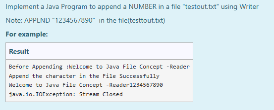

# Ex.No:8(B) IO-FILE READER/WRITER

## AIM:
To create a Java program to append a NUMBER in a file “testout.txt” using Writer.
*Note: APPEND "1234567890" in the file (testout.txt)*

## ALGORITHM :
1. Create or open the file `testout.txt` using `FileWriter` in append mode.
2. Write the string `"1234567890"` to the file.
3. Close the writer.
4. Display a message that confirms the operation was successful.
5. Use exception handling to catch any file I/O errors.

## PROGRAM:

```
/*
Program to implement a IO File Reader/Writer using Java
Developed by: Muhammad Afshan A
RegisterNumber: 212223100035
*/
```

## PROGRAM QUESTION AND SAMPLE INPUT:


## SOURCECODE.JAVA:

```
import java.io.*;

public class AppendToFile {
    public static void main(String[] args) {
        String s = "1234567890";
        try (FileWriter wr = new FileWriter("testout.txt",true)) {
            wr.write(s);
            System.out.println("Append the character in the File Successfully");
        } catch (Exception e) {
            System.out.println(e);
        }
    }
}
```

## OUTPUT:


## RESULT :
Thus, the Java program to append a NUMBER in a file “testout.txt” using Writer was executed and verified successfully.
