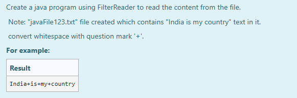

# Ex.No:8(C)             FILTER READER

## AIM:
To create a Java program using `FilterReader` to read the content from a file.
*Note: The "javaFile123.txt" file is created containing the text "India is my country". Spaces are converted to '+' while reading.*

## ALGORITHM:
1. Start the program.
2. Create a class `CustomFilterReader1` extending `FilterReader`.

   * Override the `read()` method to replace spaces with '+'.
3. In the `main()` method:

   * Use `FileOutputStream` and `FilterOutputStream` to write `"India is my country"` into the file `javaFile123.txt`.
   * Close the output stream.
4. Open `FileReader` on `javaFile123.txt` and wrap it with `CustomFilterReader1`.
5. Read characters one by one and print them, spaces being replaced by '+'.
6. Close the reader streams.

## PROGRAM:

```
/*
Program to implement a Filter Reader using Java
Developed by: Muhammad Afshan A
RegisterNumber: 212223100035
*/
```

## PROGRAM QUESTION AND SAMPLE INPUT:


## SOURCECODE.JAVA:

```
import java.io.*;

class CustomFilterReader1 extends FilterReader {
    CustomFilterReader1(Reader in) {
        super(in);
    }

    public int read() throws IOException {
        int x = super.read();
        if ((char)x == ' ') {
            return (int)'+';
        } else {
            return x;
        }
    }
}

public class FilterReaderExample {
    public static void main(String[] args) {
        String content = "India is my country";

        try {
            // Write initial content to file
            FileOutputStream fout = new FileOutputStream("javaFile123.txt");
            FilterOutputStream filter = new FilterOutputStream(fout);
            byte b[] = content.getBytes();
            filter.write(b);
            filter.close();
            fout.close();

            // Read file using custom filter
            FileReader fr = new FileReader("javaFile123.txt");
            CustomFilterReader1 filterReader = new CustomFilterReader1(fr);

            int i;
            while ((i = filterReader.read()) != -1) {
                System.out.print((char)i);
            }

            filterReader.close();
            fr.close();
        } catch (IOException e) {
            System.out.println("Error: " + e);
        }
    }
}
```

## OUTPUT:


## RESULT:
Thus, the Java Program to read the content from the file using `FilterReader` and replacing spaces with '+' was executed and verified successfully.
