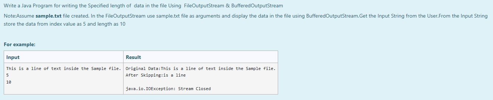
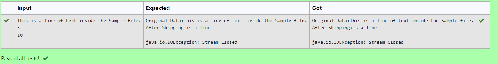

# Ex.No:8(D) BUFFER INPUT/OUTPUT STREAM

## AIM:
To Write a Java Program for writing the Specified length of data in the file Using FileOutputStream & BufferedOutputStream
*Note: Assume `sample.txt` file created. In the FileOutputStream use `sample.txt` file as argument and display the data in the file using BufferedOutputStream. Get the Input String from the User. From the Input String store the data from index value as 5 and length as 10*

## ALGORITHM :
1. Import `java.io.*` and `java.util.*` for file handling and user input.
2. Open `sample.txt` using `FileOutputStream`.
3. Use `BufferedOutputStream` to write to the file.
4. Read the input string from user.
5. Convert the string to byte array.
6. Skip the required number of bytes and write the specified length of data.
7. Close the stream after writing.

## PROGRAM:

```
/*
Program to implement a Buffer Input/Output Stream using Java
Developed by: Muhammad Afshan A
RegisterNumber: 212223100035
*/
```

## PROGRAM QUESTION AND SAMPLE INPUT:


## SOURCECODE.JAVA:

```
import java.io.*;
import java.util.*;

public class Main {
    public static void main(String[] args) {
          try(FileOutputStream fout = new FileOutputStream("sample.txt"))
  {
            BufferedOutputStream bf = new BufferedOutputStream(fout);
            Scanner sc = new Scanner(System.in);
            String s = sc.nextLine();
            byte[] b = s.getBytes();
            System.out.println("Original Data:"+s);
            //bf.write(b);
            System.out.print("After Skipping:");
            int a = sc.nextInt();
            int bl = sc.nextInt();
            bf.write(b,a,bl);
            bf.close();
  }
catch (IOException e) 
{
      e.printStackTrace();
}
    
    }
}
```

## OUTPUT:


## RESULT :
Thus, the Java program file for displaying the data from the file after skip method using FileOutputStream & BufferedOutputStream was executed and done successfully.
