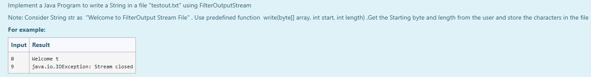
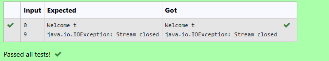

# Ex.No:8(E) FILE WRITING WITH FILTEROUTPUTSTREAM

## AIM:
To implement a Java program to write a specific part of a string to a file named "testout.txt" using `FilterOutputStream`.

*Note: Consider String `str` as "Welcome to FilterOutput Stream File". Use the predefined function `write(byte[] array, int start, int length)`. Get the starting byte index and length from the user, and write the corresponding characters to the file.*

## ALGORITHM :
1. Start the program.
2. Import the `java.io.*` and `java.util.*` packages.
3. Define the `Main` class and its `main()` method.
4. Implement the file operations within a `try-catch` block to handle potential exceptions.
5. Inside the `try` block:
    - a. Create a `Scanner` object to read input from the user.
    - b. Create a `FileOutputStream` object linked to the file "testout.txt".
    - c. Create a `FilterOutputStream` object, wrapping the `FileOutputStream`.
    - d. Declare a `String` variable `str` and initialize it with "Welcome to FilterOutput Stream File".
    - e. Prompt the user to enter the starting index for the substring to be written and read it into an integer variable `start`.
    - f. Prompt the user to enter the length of the substring to be written and read it into an integer variable `length`.
    - g. Convert the `str` string into a byte array `b` using `getBytes()`.
    - h. Write the specified portion of the byte array to the file using `fos.write(b, start, length)`.
    - i. Close the `FilterOutputStream` (`fos.close()`).
    - j. Close the `FileOutputStream` (`f.close()`).
6. In the `catch` block, print any exceptions that occur.
7. End the program.


## PROGRAM:
```
/*
Program to implement File Writing using FilterOutputStream in Java
Developed by: Muhammad Afshan A
RegisterNumber: 212223100035
*/
```

## PROGRAM QUESTION AND SAMPLE INPUT:


## SOURCECODE.JAVA:
```
import java.io.FileOutputStream;
import java.io.FilterOutputStream;
import java.util.Scanner;

public class Main {
    public static void main(String[] args) {
        try
    {
        Scanner sc = new Scanner(System.in);
        FileOutputStream f = new FileOutputStream("testout.txt");
        FilterOutputStream fos = new FilterOutputStream(f);
        String str="Welcome to FilterOutput Stream File";
        int start = sc.nextInt();
        int length = sc.nextInt();
        byte b[]=str.getBytes();
        fos.write(b,start,length);
        fos.close();
        f.close();
    }
    catch(Exception e){System.out.println(e);}
    }
}
```

---

## OUTPUT:


## RESULT :
Thus, the Java program successfully implements writing a specific portion of a string to a file named "testout.txt" using `FilterOutputStream`, based on user-provided starting index and length.