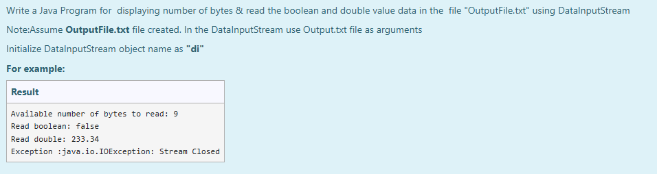
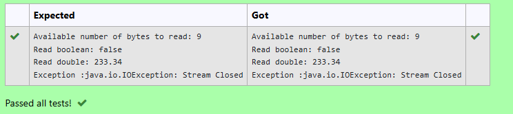

# Ex.No:9(A) DATA I/O STREAM

## AIM:
To Write a Java Program for displaying number of bytes & read the boolean and double value data in the file "OutputFile.txt" using DataInputStream
*Note: Assume OutputFile.txt file created. In the DataInputStream use Output.txt file as arguments*
* Initialize DataInputStream object name as "di"

## ALGORITHM :
1. Create a `FileOutputStream` and wrap it in a `DataOutputStream` to write data to "OutputFile.txt".
2. Use `writeBoolean()` and `writeDouble()` to write a boolean and a double value respectively.
3. Close the output streams after writing.
4. Reopen the file using `FileInputStream` and `DataInputStream` (object `di`) to read the values back.
5. Display the number of available bytes using `di.available()`.
6. Use `di.readBoolean()` and `di.readDouble()` to read the stored values.
7. Close the input stream and handle exceptions if any occur.

## PROGRAM:

```
/*
Program to implement a DATA I/O STREAM using Java  
Developed by: Muhammad Afshan A  
RegisterNumber: 212223100035  
*/
```

## PROGRAM QUESTION AND SAMPLE INPUT:


## SOURCECODE.JAVA:
```
import java.io.*;

public class Main {
    public static void main(String[] args) {
        try {
            // Writing to the file
            FileOutputStream fout = new FileOutputStream("OutputFile.txt");
            DataOutputStream dout = new DataOutputStream(fout);
            dout.writeBoolean(false);
            dout.writeDouble(233.34);
            dout.close();
            fout.close();

            // Reading from the file
            FileInputStream fin = new FileInputStream("OutputFile.txt");
            DataInputStream di = new DataInputStream(fin);

            System.out.println("Available number of bytes to read: " + di.available());
            System.out.println("Read boolean: " + di.readBoolean());
            System.out.println("Read double: " + di.readDouble());

            di.close();
            fin.close();

        } catch (IOException e) {
            System.out.println("Exception: " + e);
        }
    }
}
```

## OUTPUT:


## RESULT:
Thus the Java Program to store a boolean and double value in a file "OutputFile.txt" using DataOutputStream and read the values using DataInputStream was executed and verified successfully.
