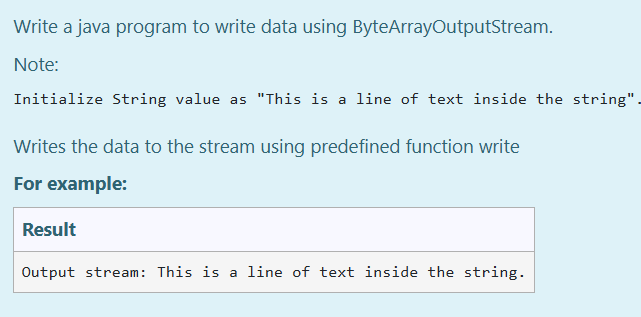
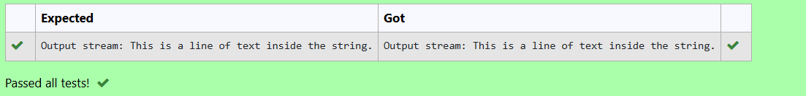

# Ex.No:9(B) BYTE ARRAY I/O

## AIM:
To Write a java program to write data using ByteArrayOutputStream.
*Note: Initialize String value as "This is a line of text inside the string".*

* Writes the data to the stream using predefined function write

## ALGORITHM :
1. The user enters a string (data), followed by two integers (start and length) specifying the starting position and number of characters to write.
2. The string data is converted to a byte array (`array`).
3. Using `ByteArrayOutputStream`, it writes length bytes from array, starting at start.
4. The written data is retrieved as a string (`streamData`) and displayed, showing the original input and the specific segment written to the stream.
5. Any exceptions are caught and handled, displaying stack trace information if an error occurs.

## PROGRAM:

```
/*
Program to implement a BYTE ARRAY I/O using Java
Developed by: Muhammad Afshan A
RegisterNumber: 212223100035
*/
```

## PROGRAM QUESTION AND SAMPLE INPUT:


## SOURCECODE.JAVA:

```
import java.io.*;

public class Main {
    public static void main(String[] args) {
        String data = "This is a line of text inside the string.";
        try {
            ByteArrayOutputStream out = new ByteArrayOutputStream();
            byte[] array = data.getBytes();

            out.write(array);

            String streamData = out.toString();
            System.out.println("Output stream: " + streamData);
            out.close();
        } catch (Exception e) {
            e.printStackTrace();
        }
    }
}
```

## OUTPUT:


## RESULT :
Thus, java program to write data using ByteArrayOutputStream was executed and verified successfully .