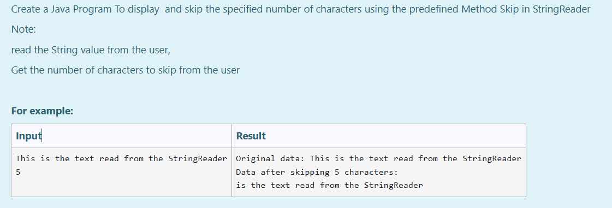
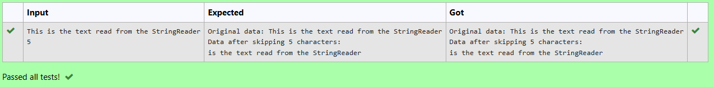

# Ex.No:9(C) STRING READER

## AIM:
To Create a Java Program To display and skip the specified number of characters using the predefined Method `skip` in `StringReader`
*Note: Read the String value from the user, Get the number of characters to skip from the user*

## ALGORITHM :
1. The user enters a string (`data`) and an integer (`skipnumber`) indicating the number of characters to skip.
2. The original string is displayed for reference.
3. A `StringReader` object, `input`, is created to read from `data`.
4. The program skips the specified number of characters (`skipnumber`) in the string.
5. It reads and displays the remaining characters one by one until the end of the string.
6. Any exceptions are caught, and stack trace information is generated if an error occurs.

## PROGRAM:

```
/*
Program to implement a String Reader using Java
Developed by: Muhammad Afshan A
RegisterNumber: 212223100035
*/
```

## PROGRAM QUESTION AND SAMPLE INPUT:


## SOURCECODE.JAVA:

```
import java.io.*;
import java.util.*;

public class Main {
    public static void main(String[] args) {
        Scanner sc = new Scanner(System.in);
        String data = sc.nextLine();

        System.out.println("Original data: " + data);

        try {
            int k = 0;
            StringReader input = new StringReader(data);
            int a = sc.nextInt();
            input.skip(a);
            System.out.println("Data after skipping " + a + " characters:");

            while ((k = input.read()) != -1) {
                System.out.print((char) k);
            }

            input.close();
        } catch (Exception e) {
            e.printStackTrace();
        }
    }
}
```

## OUTPUT:


## RESULT :
Thus the Java Program to display and skip the specified number of characters using the predefined Method `skip` in `StringReader` was executed and verified successfully.
