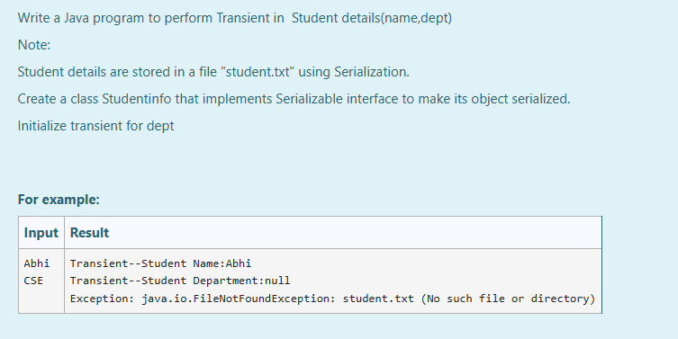
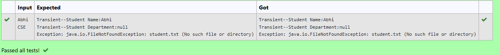

# Ex.No:9(D) TRANSIENT ---SERIALIZATION

## AIM:
To Write a Java program to perform Transient in Student details (name, dept)  
*Note: Student details are stored in a file "student.txt" using Serialization.*  
- Create a class Studentinfo that implements Serializable interface to make its object serialized.  
- Initialize transient for dept  

## ALGORITHM :
1. Define a `Studentinfo` class that implements `Serializable` and mark the `dept` field as `transient`.
2. In the `main` method, use `Scanner` to get student name and department from the user.
3. Serialize the object and store it in a file named `student.txt`.
4. Deserialize the object from the file.
5. Print the name and department. The department will be `null` because it was marked as `transient`.
6. Delete `student.txt` and try to read from it again, which will raise a `FileNotFoundException`.

## PROGRAM:
```
/*
Program to implement a Transient using Java
Developed by: Muhammad Afshan A
RegisterNumber: 212223100035
*/
```
## PROGRAM QUESTION AND SAMPLE INPUT:


## SOURCECODE.JAVA:

```
import java.io.*;
import java.util.*;

class Studentinfo implements Serializable {
    String name;
    transient String dept;

    Studentinfo(String n, String d) {
        this.name = n;
        this.dept = d;
    }
}

public class Main {
    public static void main(String[] args) {
        try {
            Scanner sc = new Scanner(System.in);
            String name = sc.nextLine();
            String dept = sc.nextLine();

            Studentinfo s1 = new Studentinfo(name, dept);

            FileOutputStream fout = new FileOutputStream("student.txt");
            ObjectOutputStream out = new ObjectOutputStream(fout);
            out.writeObject(s1);
            out.close();
            fout.close();

            FileInputStream fin = new FileInputStream("student.txt");
            ObjectInputStream in = new ObjectInputStream(fin);
            Studentinfo s2 = (Studentinfo) in.readObject();
            in.close();
            fin.close();

            System.out.println("Transient--Student Name: " + s2.name);
            System.out.println("Transient--Student Department: " + s2.dept);

            File f = new File("student.txt");
            if (f.delete()) {
                FileInputStream fin2 = new FileInputStream("student.txt");
                ObjectInputStream in2 = new ObjectInputStream(fin2);
                Studentinfo s3 = (Studentinfo) in2.readObject();
                in2.close();
                fin2.close();
            }

        } catch (Exception e) {
            System.out.println("Exception: " + e);
        }
    }
}
```

## OUTPUT:


## RESULT :
Thus, implementation of a Java program to perform Transient in Student details in Serializable interface to make its object serialized was executed and verified successfully.

