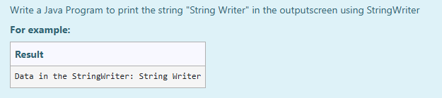

# Ex.No:9(E) STRING WRITER

## AIM:
To Write a Java Program to print the string "String Writer" in the outputscreen using StringWriter.

## ALGORITHM :
1. Start the program.
2. Import the java.io.StringWriter class.
3. Define the main class and main method.
4. Initialize the string data with the value "String Writer".
5. Create a StringWriter object.
6. Write the string data to the StringWriter object using the write() method.
7. Convert the contents of StringWriter to a string using toString().
8. Print the string from the StringWriter to the output screen.
9. Close the StringWriter object.
10. Handle any exceptions that might occur.
11. End the program.

## PROGRAM:

```
/*
Program to implement a STRING WRITER
Developed by: Muhammad Afshan A
RegisterNumber: 212223100035
*/
```

## PROGRAM QUESTION AND SAMPLE INPUT:


## SOURCECODE.JAVA:

```
import java.io.StringWriter;

public class Main {
  public static void main(String[] args) {

    String data = "String Writer";

    try {
      StringWriter sw = new StringWriter();
      sw.write(data);
      System.out.println("Data in the StringWriter: "+sw.toString());
      sw.close();
      
    }

    catch(Exception e) {
      e.getStackTrace();
    }
  }
}
```

## OUTPUT:


## RESULT :
Thus, implementation of  a Java program was successfully reads a string from the user and uses StringWriter to write and print the string to the output screen .
