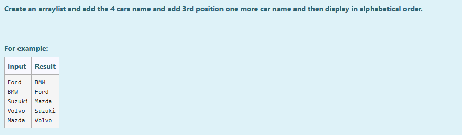
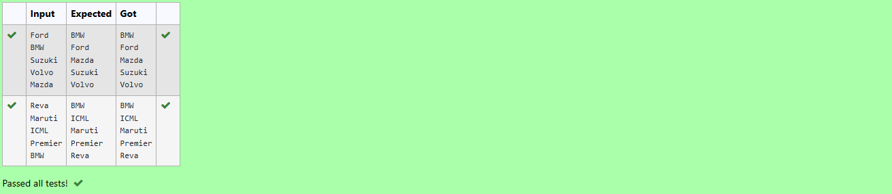

# Ex.No:10(A) JAVA COLLECTION FRAMEWORK –ARRAY LIST

## AIM:
To Create an arraylist and add the 4 cars name and add 3rd position one more car name and then display in alphabetical order.

## ALGORITHM:
1. Start the program.
2. Import `java.util.ArrayList`, `java.util.Collections`, and `java.util.Scanner`.
3. Define the main class and main method.
4. Create an `ArrayList<String>` named `cars`.
5. Create a `Scanner` object to read user input.
6. Read 4 car names from the user and add them to the `cars` list.
7. Read another car name from the user and add it at the 3rd position (index 2) in the list.
8. Sort the `cars` list in alphabetical order using `Collections.sort()`.
9. Use a for-each loop to print all car names in the sorted list.
10. Close the scanner.
11. End the program.

## PROGRAM:

```
/*
Program to implement a ARRAY LIST using Java
Developed by: Muhammad Afshan A
RegisterNumber: 212223100035
*/
```

## PROGRAM QUESTION AND SAMPLE INPUT:


## SOURCECODE.JAVA:

```
import java.util.ArrayList;
import java.util.Collections;
import java.util.Scanner;

public class Main {
    public static void main(String[] args) {
        ArrayList<String> cars = new ArrayList<>();
        Scanner scanner = new Scanner(System.in);

        cars.add(scanner.nextLine());
        cars.add(scanner.nextLine());
        cars.add(scanner.nextLine());
        cars.add(scanner.nextLine());

        String newCar = scanner.nextLine();
        cars.add(2, newCar);

        Collections.sort(cars);

        for (String car : cars) {
            System.out.println(car);
        }

        scanner.close();
    }
}
```

## OUTPUT:


## RESULT:
Thus the Java Program to create an ArrayList of car names, add an extra car at the 3rd position, and display the list in alphabetical order was executed successfully.
