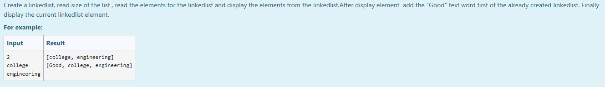
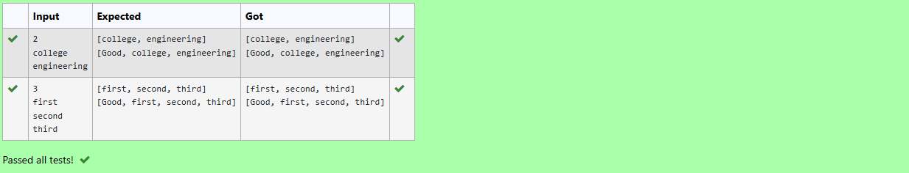

# Ex.No:10(B) JAVA LINKED LIST

## AIM :
To Create a linkedlist, read size of the list , read the elements for the linkedlist and display the elements from the linkedlist.After display element add the "Good" text word first of the already created linkedlist. Finally display the current linkedlist element.

## ALGORITHM :
1. Start the program.
2. Import `java.util.*` for input handling and list functionality.
3. Define the main class and main method.
4. Create a `Scanner` object to read input.
5. Read an integer `n` representing the number of strings.
6. Create a `LinkedList<String>` named `list`.
7. Use a for loop to read `n` strings and add each to `list`.
8. Print the entire linked list `list`.
9. Add the string "Good" to the beginning of the linked list using `addFirst()`.
10. Print the updated linked list.
11. Close the scanner.
12. End the program.

## PROGRAM:
```
/*
Program to implement a JAVA LINKED LIST using Java
Developed by: Muhammad Afshan A
RegisterNumber: 212223100035
*/
```

## PROGRAM QUESTION AND SAMPLE INPUT:


## SOURCECODE.JAVA:
```
import java.util.*;

public class Main {
    public static void main(String[] args) {
        Scanner sc = new Scanner(System.in);
        int n = sc.nextInt();
        LinkedList<String> list = new LinkedList<>();
        for (int i = 0; i < n; i++)
            list.add(sc.next());
        System.out.println(list);
        list.addFirst("Good");
        System.out.println(list);
    }
}
```

## OUTPUT :


## RESULT:  
Thus the Java program of the creation of a linkedlist was executed successfully .