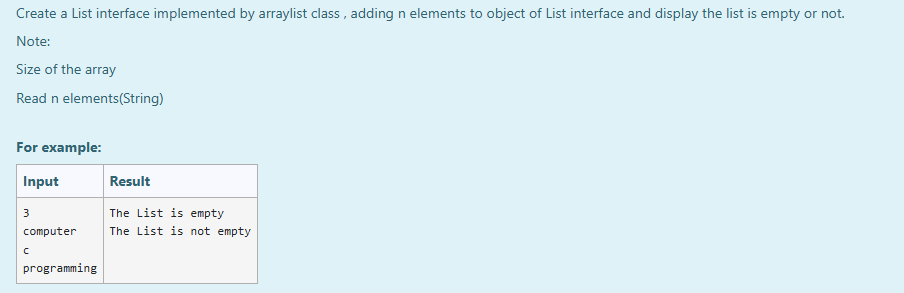
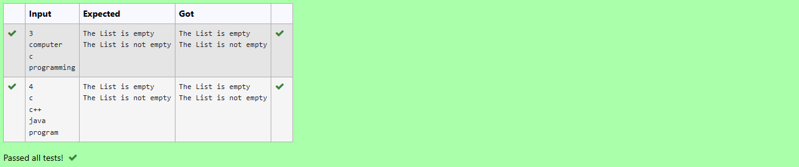

# Ex.No:10(C) JAVA LIST INTERFACE

## AIM :
To Create a List interface implemented by arraylist class , adding n elements to object of List interface and display the list is empty or not.
*Note:*
* Size of the array
* Read n elements(String)

## ALGORITHM :
1. Start the program.
2. Import `java.util.*` package.
3. Define the class `ListExample` with the `main` method.
4. Create a `Scanner` object to read input.
5. Create a `List<String>` using the `ArrayList` class.
6. Check if the list is empty using `isEmpty()` and print the appropriate message.
7. Read an integer `n` which indicates the number of elements.
8. Use a for loop to read `n` strings and add them to the list.
9. Check again if the list is empty and print the result.
10. Close the scanner.
11. End the program.

## PROGRAM:

```
/*
Program to implement a JAVA LIST INTERFACE using Java
Developed by: Muhammad Afshan A
RegisterNumber: 212223100035
*/
```

## PROGRAM QUESTION AND SAMPLE INPUT:


## SOURCECODE.JAVA:
```
import java.util.ArrayList;
import java.util.List;
import java.util.Scanner;

public class ListExample {
    public static void main(String[] args) {
        Scanner scanner = new Scanner(System.in);
        List<String> list = new ArrayList<>();

        if (list.isEmpty()) {
            System.out.println("The List is empty");
        } else {
            System.out.println("The List is not empty");
        }

        int n = scanner.nextInt();
        scanner.nextLine();

        for (int i = 0; i < n; i++) {
            String element = scanner.nextLine();
            list.add(element);
        }

        if (list.isEmpty()) {
            System.out.println("The List is empty");
        } else {
            System.out.println("The List is not empty");
        }

        scanner.close();
    }
}
```

## OUTPUT:


## RESULT :
Thus the java program implemented a List interface for array list was executed and verified successfully .
