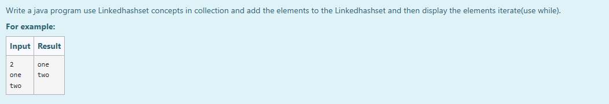

# Ex.No:10(D) JAVA HASHSET & LINKEDHASHSET

## AIM:
To Write a java program use Linkedhashset concepts in collection and add the elements to the Linkedhashset and then display the elements iterate(use while).

## ALGORITHM :
1. Start the Program.
2. Import `java.util.*`
3. Define class `HashSetDemo` with `main` method:

   * a) Initialize `Scanner` and read integer `n`
   * b) Create a `LinkedHashSet` named `hs` to store unique strings
4. Use a loop to read `n` strings and add each to `hs`
5. Use a `while` loop with `Iterator` to print each element in `hs`
6. End

## PROGRAM:

```
/*
Program to implement a JAVA HASHSET & LINKEDHASHSET using Java
Developed by: Muhammad Afshan A
RegisterNumber: 212223100035
*/
```

## PROGRAM QUESTION AND SAMPLE INPUT:


## SOURCECODE.JAVA:

```
import java.util.*;

public class HashSetDemo{

public static void main(String[] args){

LinkedHashSet<String> hs = new LinkedHashSet <String>();
Scanner sc=new Scanner(System.in);
int n=sc.nextInt();
for(int i=0;i<n;i++)
{
    
hs.add(sc.next());

}
 Iterator<String> i=hs.iterator();  
 while(i.hasNext())  
 {  
    System.out.println(i.next());  
 }  

}
}
```

## OUTPUT:


## RESULT :
Thus the java program of hashmap concepts was executed and verified successfully .
