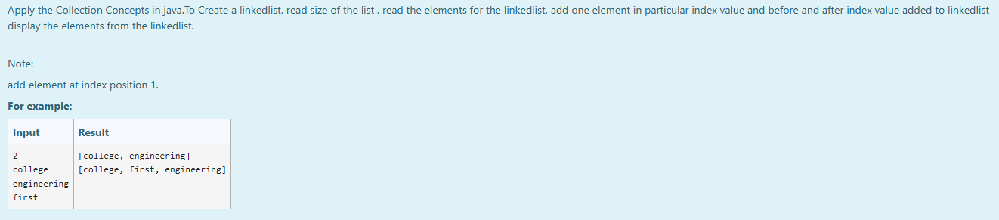
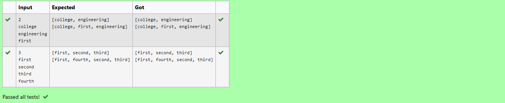

# Ex.No:10(E) JAVA LINKEDLIST OPERATIONS

## AIM:
To Apply the Collection Concepts in java.To Create a linkedlist, read size of the list , read the elements for the linkedlist, add one element in particular index value and before and after index value added to linkedlist display the elements from the linkedlist.

*Note:
add element at index position 1.*

## ALGORITHM :
1. Start the program.
2. Import necessary classes: `java.util.LinkedList` and `java.util.Scanner`.
3. Define the class (e.g., `prog` or `Main`) and its `main()` method.
4. Create two `LinkedList<String>` objects: `al` and `al2`.
5. Create a `Scanner` object to read input.
6. Read an integer `size` from the user for the number of initial elements.
7. Loop `size` times, reading a string element in each iteration and adding it to `al`.
8. Read a string element from the user and add it to `al2` (this element will be inserted).
9. Print the current state of `al` (before insertion).
10. Use the `addAll(index, Collection)` method of `al` to insert all elements from `al2` starting at index 1.
11. Print the updated state of `al` (after insertion).
12. Close the `Scanner` object.
13. End the program.

## PROGRAM:
```
/*
Program to implement a LINKEDLIST OPERATIONS
Developed by: Muhammad Afshan A
RegisterNumber: 212223100035
*/
```

## PROGRAM QUESTION AND SAMPLE INPUT:


## SOURCECODE.JAVA:
```
import java.util.*;
import java.io.*;

public class prog{
    public static void main(String[] args){
        LinkedList<String> al = new LinkedList<String>();
        LinkedList<String> al2 = new LinkedList<String>();
        Scanner sc = new Scanner(System.in);
        int size = sc.nextInt();
        for(int i=0;i<size;i++){
            al.add(sc.next());
        }
        al2.add(sc.next());
        System.out.println(al);
        al.addAll(1,al2);
        System.out.println(al);
    }
}
```

## OUTPUT:


## RESULT :
Thus, the Java program successfully demonstrates `LinkedList` operations by reading elements, inserting a new element at a specified index, and displaying the list's state both before and after the insertion.