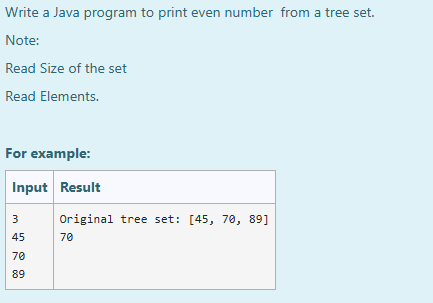
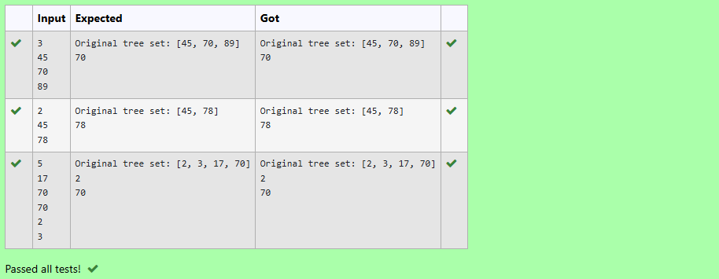

# Ex.No:11(A) JAVA TREESET

## AIM:
To Write a Java program to print even number from a tree set.
*Note:*

* Read Size of the set
* Read Elements.

## ALGORITHM :
1. Start
2. Import `java.util.*`
3. Define class `prog` with `main` method:

   * a) Initialize `Scanner` and read integer `n`
   * b) Create a `TreeSet` named `ts` to store integers in sorted order
4. Use a loop to read `n` integers and add each to `ts`
5. Use an `Iterator` to traverse the set
6. Inside the loop, check and print only even numbers
7. End

## PROGRAM:

```
/*
Program to implement a JAVA TREESET using Java
Developed by: Muhammad Afshan A
RegisterNumber: 212223100035
*/
```

## PROGRAM QUESTION AND SAMPLE INPUT:


## SOURCECODE.JAVA:

```
import java.util.*;

public class prog {
    public static void main(String[] args) {
        TreeSet<Integer> ts = new TreeSet<Integer>();
        Scanner sc = new Scanner(System.in);
        int a = sc.nextInt();
        for (int i = 0; i < a; i++) {
            ts.add(sc.nextInt());
        }
        Iterator<Integer> iterator = ts.iterator();
        System.out.println("Original tree set: " + ts);
        while (iterator.hasNext()) {
            int i = iterator.next();
            if (i % 2 == 0) {
                System.out.println(i);
            }
        }
    }
}
```

## OUTPUT:


## RESULT :
Thus the java program to iterate through all elements in a tree set was executed successfully .