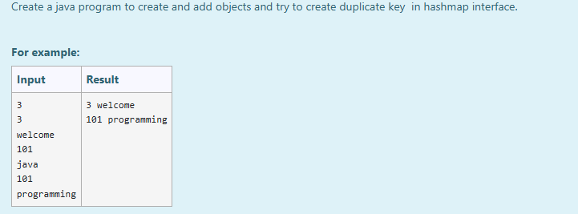

# Ex.No:11(B) JAVA MAP & HASHMAP AND HASHTABLE

## AIM :
To Create a java program to create and add objects and try to create duplicate key in hashmap interface.

## ALGORITHM :
1. Start
2. Import `java.util.*`
3. Define class `prog` with `main` method:

   * a) Initialize `Scanner` and read integer `s`
   * b) Create a `HashMap<Integer, String>` named `map`
4. Use a loop to:

   * a) Read an integer and a string
   * b) Add them to `map` as key-value pairs
   * c) If a duplicate key is entered, it will overwrite the existing value
5. Use a `for-each` loop over `map.entrySet()` to print each key-value pair
6. End

## PROGRAM:

```
/*
Program to implement a JAVA MAP & HASHMAP AND HASHTABLE using Java
Developed by: Muhammad Afshan A
RegisterNumber: 212223100035
*/
```

## PROGRAM QUESTION AND SAMPLE INPUT:


## SOURCECODE.JAVA:
```
import java.util.*;
public class prog{
    public static void main(String[] args){
        HashMap<Integer, String> map = new HashMap<Integer, String>();
        Scanner sc = new Scanner(System.in);
        int s = sc.nextInt();
        for(int i=0;i<s;i++){
            int num = sc.nextInt();
            String st = sc.next();
            map.put(num, st);
        }
        for(Map.Entry m: map.entrySet()){
            System.out.println(m.getKey()+ " "+ m.getValue());
        }
    }
}
```

## OUTPUT:


## RESULT :
Thus the Java program to retrieve the key and value from a HashMap (and handle duplicate keys) was executed successfully.
