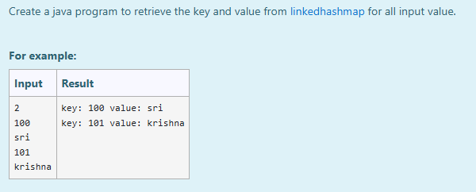
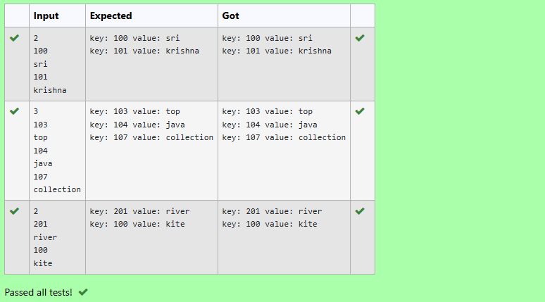

# Ex.No:11(C) JAVA LINKED HASHMAP

## AIM :
To Create a java program to retrieve the key and value from linkedhashmap for all input value.

## ALGORITHM :
1. Start the Program
2. Import `java.util.*`
3. Define class `prog` with `main` method:

   * a) Initialize `Scanner` and read integer `a`
   * b) Create a `LinkedHashMap<Integer, String>` named `map`
4. Use a loop to:

   * a) Read an integer and a string from the user
   * b) Add them as key-value pairs to `map`
5. Use a `for-each` loop to print each key-value pair in insertion order
6. Optionally, check if key `104` exists using `containsKey(104)` and print result
7. End

## PROGRAM:

```
/*
Program to implement a JAVA LINKED HASH MAP using Java  
Developed by: Muhammad Afshan A  
RegisterNumber: 212223100035  
*/
```

## PROGRAM QUESTION AND SAMPLE INPUT:


## SOURCECODE.JAVA:

```
import java.util.*;
public class prog {
    public static void main(String[] args) {
        LinkedHashMap<Integer, String> map = new LinkedHashMap<Integer, String>();
        Scanner sc = new Scanner(System.in);
        int a = sc.nextInt();
        for (int i = 0; i < a; i++) {
            int num = sc.nextInt();
            String aa = sc.next();
            map.put(num, aa);
        }
        for (Map.Entry m : map.entrySet()) {
            System.out.println("key: " + m.getKey() + " value: " + m.getValue());
        }

        if (map.containsKey(104)) {
            System.out.println("Key 104 is present in the map.");
        } else {
            System.out.println("Key 104 is not present in the map.");
        }
    }
}
```

## OUTPUT:


## RESULT :
Thus the java program to retrieve the key and value from linkedhashmap for all input value was executed successfully.
