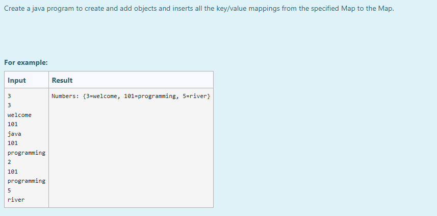

# Ex.No:11(D) RELATED TO MAP CONCEPTS

## AIM:
Create a Java program to create and add objects and insert all the key/value mappings from the specified Map to another Map.

## ALGORITHM :
1. Start
2. Import `java.util.*`
3. Define class `prog` with `main` method:

   * a) Initialize `Scanner` and read integer `size`
   * b) Create a `HashMap<Integer, String>` named `map`
4. Loop to read `size` key-value pairs and add them to `map`
5. Read another integer `size1` and create a new `HashMap` named `numbers`
6. Loop to read `size1` key-value pairs and add to `numbers`
7. Use `putAll()` method to insert all mappings from `map` into `numbers`
8. Print the merged map
9. End

## PROGRAM:

```
/*
Program to implement a RELATED TO MAP CONCEPTS using Java  
Developed by: Muhammad Afshan A  
RegisterNumber: 212223100035  
*/
```

## PROGRAM QUESTION AND SAMPLE INPUT:


## SOURCECODE.JAVA:

```
import java.util.*;
class prog{  
 public static void main(String args[]){ 
     
  Map<Integer,String> map=new HashMap<>(); 
  Scanner sc=new Scanner(System.in);
  
  int size=sc.nextInt();
  for(int i=0;i<size;i++)
  {
  Integer a=sc.nextInt();
  String b=sc.next();
  map.put(a,b);  
  } 
 HashMap<Integer, String> numbers = new HashMap<>();
  int size1=sc.nextInt();
  for(int i=0;i<size1;i++)
  {
  Integer a=sc.nextInt();
  String b=sc.next();
  numbers.put(a,b);  
  } 
  numbers.putAll(map);
    System.out.println("Numbers: "+numbers);   
 }  
}    
```

## OUTPUT:


## RESULT :
Thus the Java program to insert and display key-value pairs using the Map interface and `putAll()` method was executed and verified successfully.
